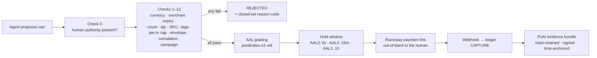

# OpenStore

**An AI sales channel any merchant can switch on in three commands — with spending rules a human signs, money the AI can never touch, and a receipt no one can dispute.**

> Built for the **Razorpay Buildathon**, Track 01 — *AI Growth & Agentic Commerce*.
> Joseph Fernando · CIT Chennai · one person, one AI pair-programmer.

```bash
uv sync
uv run openstore init --merchant "Gelateria Milano" --currency INR
uv run openstore serve gelateria.yaml
```

Three commands, **no API keys required** — migrations run on first boot and the store comes up serving a discovery manifest, a UCP capability manifest, an agent-readable catalog, 18 MCP commerce tools, checkout, hold/cancel, a signed campaign feed, and a cryptographic evidence trail for every rupee that moves. Add Razorpay test-mode keys when you want money to actually move.

**Jump to:** [Why this exists](#why-this-exists) · [Meeting the bar](#meeting-the-bar) · [Growth](#growth-the-revenue-half) · [The demo](#the-demo) · [How it works](#how-it-works) · [The money path](#the-money-path) · [PoAI](#the-receipt-proof-of-authorized-intent-poai) · [Agents](#the-agent-layer) · [Getting started](#getting-started) · [What's real / what's next](#whats-real--whats-next)

---

## Why this exists

### The integration already exists — for two companies at a time

AI-mediated commerce in India is not hypothetical and this project does not pretend to invent it. Razorpay's in-app agentic pilots are live. Large platforms are wiring conversational ordering into their apps today. It works.

It works **bilaterally**. A pilot like that is a negotiated integration between one large platform and one large merchant: custom endpoints, a shared roadmap, an account manager, a legal review. The merchant is inside the integration or outside it, and the cost of being inside is a scale most merchants will never have.

So the capability exists, and it is unavailable to precisely the merchants who most need a new demand channel — the gelateria with 40 SKUs, the chai house with a YAML file and no engineering team. **OpenStore is that same channel, decoupled**: a sidecar that any merchant runs beside the store they already have, with no counterparty to negotiate with, no platform to be admitted to, and no code to migrate.

### What a bilateral integration still doesn't give you

Even inside one, two things are missing, and they are the two this project is actually about.

**Nothing to hand an arbitrator.** When the customer says *"I never authorized that"* ninety days later, the evidence is whatever the platform's logs say it is — a claim by an interested party, in a format only that party can produce, verifiable only by trusting them. Every protocol in the current race (ACP, UCP, AP2, x402, TAP, Agent Pay, NPCI UAP) answers *how does an agent pay?* None of them answers *what does the merchant hand an arbitrator?* OpenStore's answer is the **PoAI bundle**: hash-chained, merchant-signed, time-anchored, and checkable offline by anyone, including someone who thinks the merchant is lying.

**Nothing that grows the merchant.** A payment integration makes a merchant *transactable*. It does not tell them which SKU has stalled, draft the campaign that fixes it, or put that offer where an AI buyer will find it. Agentic commerce that only handles checkout has automated the last five seconds of the funnel. OpenStore ships the other end too — [analytics, campaign orchestration, cross-sell, and an autonomous growth loop](#growth-the-revenue-half) — under the same rule that governs the money path: **the agent proposes, a human signs, a deterministic compiler disposes.**

| The protocols make a merchant... | OpenStore makes a transaction... |
|---|---|
| transactable (ACP, UCP) | **defensible** (PoAI bundles, offline-verifiable) |
| payable (AP2, TAP, Agent Pay) | **bounded** (human-signed compiler, not vibes) |
| discoverable (manifests, feeds) | **governed** (AAL ladder: stronger proof → faster fulfillment) |

Where it overlaps, it interoperates rather than competes. The sidecar serves MCP at `/agent/mcp` and a **UCP** capability manifest at `/.well-known/ucp` (`dev.ucp.shopping.checkout`, `dev.ucp.shopping.discount`) — declaring only what it actually implements. The authorization model landed on the same shape **AP2** later specified: a signed `IntentPolicy` is structurally an Intent Mandate, a per-cart assertion a Cart Mandate. The difference is what enforces them — a deterministic compiler whose transcript is replayable, rather than a credential a merchant is trusted to honour.

**x402 is deliberately not on the roadmap.** It solves stablecoin micropayments between machines; this is an INR/UPI stack for human-authorized purchases. There is no honest integration story, so there isn't one. For the same reason the manifest no longer advertises ACP: the entry pointed at a version ACP never published and an endpoint that returns `not implemented`, so an ACP-aware agent that trusted it would fail on contact (DECISION-026). **A manifest is a promise; only working capabilities belong in it.**

### Why a sidecar, and not a platform

A merchant already has a store. Asking them to migrate it to be agent-ready is a non-starter, so OpenStore bolts on beside the existing one and is designed around a single seam: **every piece of catalog and order data flows through one access point.** Today that reads a YAML file, because that is what could be built and proven correct in the time available. Nothing above that line — the compiler, checkout, the agent layer — knows or cares. Point the same function at a Postgres query or a Shopify Admin API call and the merchant's real inventory shows up unchanged everywhere else in the system.

---

## Meeting the bar

Track 01 asks that every money action be explainable, bounded and gated, with an audit trail and one failure handled gracefully. Concretely:

| The bar | How | Where |
|---|---|---|
| **Explainable** | Every decision emits an ordered, byte-stable transcript of 13 named checks and a closed-set reason code. No LLM in the decision path. | `core/compiler.py` |
| **Bounded** | Spend caps per transaction, per envelope and cumulative; SKU allowlists, tag rules, merchant lock, expiry — all from a policy the human signed. | `core/compiler.py`, `core/policy_signing.py` |
| **Gated** | WebAuthn user-verified signature required before any order exists. AAL0 (no verifiable authority) creates no order at all. | `core/webauthn_rp.py`, `core/aal.py` |
| **Audit trail** | 9-section PoAI bundle, SHA-256 hash-chained, ES256-signed, Rekor-anchored, verified offline by 14 checks. Two bundles are [checked into this repo](docs/demo_assets) so you can run it now. | `core/poai.py`, `verify/` |
| **A failure, gracefully** | Four of them, below. | — |

The four failure paths, all tested:

- **A denied cart** → `policy.tag_violation`, then the merchant agent negotiates in the same DM thread, and when no in-policy path exists it drafts a policy amendment the human approves with a second passkey tap. The cart recompiles against an unpersisted, relieved policy snapshot — the standing signed policy is never mutated. *(ACT 3)*
- **A tampered receipt** → the verifier names the broken hash-chain link and exits 1. *(ACT 5)*
- **A crash mid-payment** → idempotency fingerprinting detects the in-flight call on restart and **adopts the existing Razorpay object instead of creating a second one.** `core/idempotency.py`
- **A hostile webhook** → HMAC on raw bytes, replay dedupe, out-of-order tolerance, dead-letter queue, and a sweeper that reconciles against Razorpay as the source of truth. `core/webhooks.py`

---

## Growth: the revenue half

Making a merchant transactable is table stakes. These are the parts that make them *more money*, and each one is an agent proposing something a human or a compiler has final say over.

### Aggregate analytics, not raw orders

`core/campaigns.py::get_analytics_view` is the **only** input the campaign agent ever receives: per SKU, `units_sold_7d`, `units_sold_30d`, `gross_minor_30d`, `attach_rate`, `last_sold_at`. No buyer identities, no payment data, no raw order rows (INV-14). The privacy boundary is a function signature, not a prompt asking the model to behave.

### Campaign orchestration, human-gated

The campaign agent drafts from that view, the draft passes a deterministic validator, and it publishes **only** after a merchant passkey approval bound to that specific campaign. Then the crucial part: **the discount is never taken on the offer's word.** Compiler check 12 recomputes it server-side at checkout, so a campaign that has expired, been paused, or been tampered with in transit simply doesn't apply. Approved offers are signed into `/.well-known/agent-campaigns.json`, where buyer agents discover them and re-plan around them.

Manage them from the CLI or Campaign Studio:

```bash
uv run openstore campaign draft configs/chai.yaml    # agent drafts from analytics
uv run openstore campaign list configs/chai.yaml     # DRAFT / PENDING_APPROVAL / ACTIVE / PAUSED
uv run openstore campaign pause configs/chai.yaml <campaign_id>
```

### The autonomous growth loop

The half that runs without being asked (DECISION-034). A background task inside every `openstore serve` process watches for **stalled SKUs** — 30-day units below the configured floor — drafts a campaign unprompted, and after the campaign window closes compares before/after units sold so the next draft is informed by the last one's outcome. It proposes; it never activates. Every draft still lands in `PENDING_APPROVAL` waiting for a passkey.

```bash
uv run openstore campaign check-growth configs/chai.yaml   # run the detector on demand
```

### Cross-sell that can't hallucinate a product

After a cart is built or an order completes, the buyer agent surfaces related items from `related_skus` in the merchant's catalog — a **deterministic lookup** (`surfaces/catalog.py::suggest_related_items`), rendered as a Discord embed. The LLM chooses the words around it; it cannot invent a SKU, a price, or a discount, because the suggestion is never fed back into the compiler's decision path. An upsell an agent hallucinates is a refund waiting to happen.

### A merchant bot for the stats

The merchant DMs `openstore merchant-bot` for campaign status, exposure against policy caps, recent orders, and new campaign suggestions. Its action set is a **frozenset of five** — `campaign_status`, `exposure`, `recent_orders`, `suggest_campaign`, `unknown`. It contains no mutating action **by construction, not by prompt instruction**, so no amount of prompt injection can make it approve, activate, pause or cancel anything.

---

## The demo

The full recording script, beat by beat, is in [`docs/DEMO_SCRIPT.md`](docs/DEMO_SCRIPT.md).

```
ACT 0  uv run openstore init && uv run openstore serve
       → a store that didn't exist 60 seconds ago is serving
         /.well-known/agent-commerce.json, /.well-known/ucp, a catalog feed, and 18 MCP tools

ACT 1  Human signs an IntentPolicy with a passkey:
       "₹2,000/month · ≤₹500 per order · Gelateria only · vegan items only"

ACT 2  Agent: "get me two vegan gelatos" → search → cart → 13 compiler checks pass
       → Razorpay payment link → paid → order HELD (15-min cancel window)
       → cross-sell embed: "goes well with the hazelnut"

ACT 3  Agent: "add the pistachio" → DENIED: policy.tag_violation
       → buyer agent and merchant agent negotiate in the same DM thread
       → no in-policy path → merchant agent drafts a signed policy amendment
       → human approves with one passkey tap → policy v2 → cart recompiles → ALLOW
       → then: "also, make it ₹600" → DENIED: policy.spend_per_tx_exceeded. No appeal.

ACT 4  Campaign agent notices a stalled SKU, reads aggregate sales analytics, drafts
       "Weekend vegan bundle −10%" → merchant approves in Campaign Studio with a passkey
       → signed offer hits the feed → buyer agents discover it and re-plan around it
       → the discount is recomputed by compiler check 12, not trusted from the offer

ACT 5  Dispute. openstore-verify bundle.json — offline — 14 checks — VERDICT: AAL2.
       Tamper one digit in amount_minor → chain_integrity and amount_consistency both fail.
```

---

## How it works

Three layers with one hard rule: **reasoning and money never share a process boundary.**


**The one rule that makes agents safe here (R0.9/R0.10):** LLM output is a *proposal, never a command*. Every agent-produced artifact — a substitution, a price, a campaign, a policy amendment, a cross-sell suggestion — passes through the same deterministic validators as input from a stranger. The agent modules physically cannot import payment or signing code, enforced by an import-firewall test (`tests/sentinel/test_import_firewall.py`). A hallucinating or prompt-injected agent can only ever produce a suggestion that gets rejected.

---

## The money path

Nothing reaches Razorpay without surviving all of this, in order:



- **Deterministic compiler** (`core/compiler.py`) — `human_authority_present` plus 12 checks, fixed order, stop-at-first-failure, byte-stable transcript. No LLM anywhere in the decision path.
- **Idempotency as a contract** (`core/idempotency.py`) — fingerprinted keys, in-flight detection, crash-mid-API-call recovery that adopts the existing Razorpay object instead of double-charging.
- **Double-entry ledger** (`core/ledger.py`) — append-only; escrow accounts net to zero at terminal states; reversals, never edits.
- **Webhooks that expect betrayal** (`core/webhooks.py`) — HMAC verification on raw bytes, dedupe, out-of-order tolerance, dead-letter + alerts, and a sweeper that reconciles against Razorpay as the source of truth.

---

## The receipt: Proof of Authorized Intent (PoAI)

Every completed transaction assembles a **9-section evidence bundle**: what was bought, who authorized it (the WebAuthn-signed policy + assertion), what the agent intended, what the compiler decided (with a re-runnable transcript), what the human was told, and the AAL grading. Sections are SHA-256 hash-chained, the root is ES256-signed by the merchant, and the root is time-anchored to Sigstore's Rekor transparency log (with a local Merkle fallback).

The point: **verification doesn't require trusting the merchant.**

Both bundles below are checked into [`docs/demo_assets/`](docs/demo_assets) — one clean, one with a single digit of `amount_minor` flipped from `21000` to `99999`. This is real output; run it yourself, offline, right after `uv sync`:

```console
$ uv run openstore-verify docs/demo_assets/bundle.json --merchant-jwks docs/demo_assets/jwks
bundle: poai_test_bundle_aal2 (PoAI 0.1)
AAL level: 2
liability: Proposed liability position (not a network rule): ...the human authorized a stan...
  [PASS] schema
  [PASS] chain_integrity
  [PASS] merchant_signature
  [PASS] time_anchor
  [PASS] webauthn_assertion
  [PASS] challenge_binding
  [PASS] uv_flag
  [PASS] catalog_attestations
  [PASS] compiler_digest
  [PASS] re_execution
  [PASS] amount_consistency
  [PASS] aal — level=2
  [PASS] delegation_chain — no delegation (root policy)
  [PASS] spend_chain — no delegation (root policy)
$ echo $?
0
```

One digit changed, and two independent checks catch it — the hash chain and the arithmetic:

```console
$ uv run openstore-verify docs/demo_assets/bundle_tampered.json --merchant-jwks docs/demo_assets/jwks
  [PASS] schema
  [FAIL] chain_integrity — link[0] (transaction): hash mismatch (section=transaction, link_index=0)
  ...
  [FAIL] amount_consistency — amount_minor mismatch: transaction=99999, computed from items=21000
  ...
$ echo $?
1
```

The Evidence Viewer (`/orders/{checkout_id}/evidence/view`) re-implements the same 14 checks in a single zero-dependency HTML page using browser WebCrypto — an arbitrator needs nothing but a browser.

---

## The AAL ladder — evidence-graded trust

| Level | What it means | Hold |
|---|---|---|
| **AAL3** | The human's authenticator signed **this exact cart** | 0s — fulfill now |
| **AAL2** | Fresh signed standing policy + clean compile | 15 min cancel window |
| **AAL1** | Authority presented but freshness/attestation predicates failed | 1 hour hold |
| **AAL0** | No verifiable human authority | **No order is created** |

Fulfillment keys off `RELEASED`, never order creation. The cancel link is a single-use 32-byte capability token delivered only to the customer.

---

## The agent layer

Five agent surfaces ship in the package. All keyless, all proposal-only, none able to move money:

- **Buyer agent** (`agents/buyer_graph.py`) — a LangGraph loop behind a Discord DM: goal → search → policy-aware cart → checkout → hold monitoring, with free-text handling for menu, cart, order status and cancellation. It searches **every merchant it is enrolled with** over HTTP MCP and builds one cart tagged per line with `merchant_id`.
- **Merchant agent** (`agents/merchant_agent.py`) — negotiates with buyer agents over structured counter-offers; when no in-policy path exists, drafts a **signed policy amendment** that only activates with a human's passkey tap.
- **Campaign agent** (`agents/campaign_agent.py`) — drafts from the aggregate analytics view. [See Growth](#growth-the-revenue-half).
- **Growth-trigger loop** (DECISION-034) — the autonomous half: stall detection, unprompted drafting, outcome feedback into the next draft.
- **Merchant bot** (`agents/merchant_bot.py`) — read-only reporting over a five-action frozenset.

---

## Security model

- **Credential absence, not credential discipline** — agents can't leak keys they never had (import-firewall tested).
- **WebAuthn** — full FIDO2 relying party: ES256/RS256 only, UV-flag enforcement, sign-count regression detection, challenge-bound ceremonies.
- **OAuth 2.1 + PKCE** — asymmetric ES256 tokens; the validator pins `alg` and verifies the JWS signature against the merchant JWKS before trusting any claim (`alg: none` and algorithm-confusion tokens are rejected — red-team tested).
- **Closed sets everywhere** — every reason code, route, tool name, and enum value lives in `REGISTRY.json`; code containing an unregistered identifier fails the build (`scripts/registry_diff.py`).
- **Fail loud** — no silent catches, no coercions, no retries of non-retriable errors. Every rejection carries a reason code that ends up in signed evidence.
- **Money is integers, time is UTC** — paise only, no floats; RFC 3339 everywhere (two grandfathered Unix-second exceptions, documented).

**Tested adversarially:** cart-swap, forged tokens, WebAuthn replay, idempotency-key reuse, ledger manipulation, webhook forgery/replay/reorder, OAuth algorithm confusion, prompt injection, spend-cap race conditions (TOCTOU), cross-merchant isolation, PII leakage into traces, agent compiler-bypass attempts. Golden fixtures pin every cryptographic output byte-for-byte.

---

## Getting started

### A fresh sidecar for your own store

```bash
uv sync
uv run openstore init --merchant "Gelateria Milano" --currency INR
```

That writes `gelateria.yaml`, `catalog.yaml` and `.env.example`. Fill in the catalog:

```yaml
catalog:
  - sku: "GEL-VAN-500"
    name: "Madagascar Vanilla 500ml"
    unit_minor: 21000            # ₹210.00 — integer paise, always
    tags: ["vegan", "dairy-free"]
    related_skus: ["GEL-HAZ-500"]   # deterministic cross-sell
    description: "Slow-churned, cashew-base vanilla."
```

```bash
uv run openstore serve gelateria.yaml
```

This works with **no `.env` at all** — the server applies its migrations and comes up serving `/.well-known/agent-commerce.json`, `/.well-known/ucp`, `/agent/catalog`, `/agent/mcp`, the signed campaign feed, Policy Studio (`/intent/studio`), Campaign Studio (`/campaign/studio`), `/admin/orders` and the Evidence Viewer. Add Razorpay **test-mode** keys (and an LLM key for the agent layer) to `.env` when you want live checkout. Open Policy Studio, enrol a passkey, sign your first `IntentPolicy` — and you're transactable.

Verify a completed order's evidence, offline:

```bash
curl http://localhost:8000/orders/<checkout_id>/evidence -o bundle.json
uv run openstore-verify bundle.json --merchant-jwks <(curl -s http://localhost:8000/.well-known/poai-jwks.json)
```

> Packaged as `openstore` with three entry points (`openstore`, `openstore-verify`, `openstore-buyer`), but **not published to PyPI** — run it from this repo with `uv`.

### This repo's own demo instance

Two merchants (Gelateria Milano on `:8000`, Chai House on `:8001`), a federated buyer process, and a merchant reporting bot. The full boot sequence — secrets, migrations, OAuth client registration, analytics seeding — is in [`docs/RUN.md`](docs/RUN.md).

```bash
uv run openstore serve configs/gelateria.yaml --port 8000
uv run openstore serve configs/chai.yaml --port 8001
uv run openstore-buyer configs/buyer.yaml
uv run openstore merchant-bot configs/gelateria.yaml configs/chai.yaml
```

### Running the checks

```bash
uv run pytest -q                        # 627 tests
uv run mypy src/                        # 51 source files, clean
uv run ruff check src/ tests/
uv run python scripts/registry_diff.py  # must print nothing, exit 0
```

No live credentials needed — the suite mocks Razorpay, Discord and the LLM providers, and runs on temp SQLite.

---

## Project structure

```
src/openstore/
├── core/           # the money path: compiler, ledger, AAL, PoAI, WebAuthn, OAuth, audit, campaigns
├── surfaces/       # MCP server, well-known manifests, studios, catalog feed, evidence viewer
├── agents/         # buyer · merchant · campaign · merchant bot (keyless, proposal-only)
├── psp/            # Razorpay driver + webhook router
├── verify/         # openstore-verify — 14 offline checks, exit codes 0–4
├── models.py       # SQLModel schemas
├── server.py       # FastAPI app factory + background tasks (hold expiry, growth loop)
├── config.py       # merchant config (closed key set; unknown keys hard-error)
├── cli.py          # openstore init / serve / campaign / orders / merchant-bot
└── buyer_cli.py    # openstore-buyer — the federated buyer process

configs/            # this repo's demo instance: two merchants + the buyer
data/               # SQLite DBs — gitignored, created by migrations on first boot
docs/demo_assets/   # a clean PoAI bundle, a tampered one, and the merchant's public JWKS
tests/              # stage tests · golden tests · red team · sentinels
tests/GOLDEN/       # byte-pinned fixtures: compiler · ledger · PoAI · WebAuthn · canonical · Razorpay
docs/SPECS/         # the eleven written stage contracts this was built from
REGISTRY.json       # every closed set, machine-enforced both directions
```

### The documents behind it

| File | What it is |
|---|---|
| [`docs/OPENSTORE_PRD_v3.md`](docs/OPENSTORE_PRD_v3.md) | the requirements doc everything was built from |
| [`docs/SPECS/`](docs/SPECS) | eleven stage contracts, each a testable slice (stages 12–15 shipped against numbered decisions instead) |
| [`docs/DECISIONS.md`](docs/DECISIONS.md) | numbered architectural decisions, and why the alternatives lost |
| [`docs/OPEN_QUESTIONS.md`](docs/OPEN_QUESTIONS.md) | what's still unresolved, honestly |
| [`docs/RUN.md`](docs/RUN.md) | how to boot the two-merchant demo |
| [`docs/DEMO_SCRIPT.md`](docs/DEMO_SCRIPT.md) | the 6-minute walkthrough, beat by beat |

---

## What's real / what's next

Built by one person with an AI agent across fifteen stages. The honest ledger:

**Real and tested:**
- ✅ The full money path — compiler, ledger, idempotency, hold/cancel, webhooks, reconciliation
- ✅ WebAuthn ceremonies, OAuth with signature-pinned validation, per-merchant signing keys
- ✅ PoAI bundles + offline verifier + tamper detection, with golden fixtures and two bundles in-repo
- ✅ 18 MCP tools, discovery manifests, catalog attestations, campaign pipeline
- ✅ Red-team and sentinel suites green — **627 tests**, `mypy` and `ruff` clean
- ✅ **Chat-native purchase flow (Stage 11)** — a live `discord.Client` runs in the server's
  lifespan; a buyer DMs the bot, gets a `handoffs`-table signing link if no policy exists,
  auto-resumes the errand on signature, gets the Razorpay pay link and hold/cancel status
  in-DM, and can cancel with a single-use capability token. A denied cart triggers
  `MerchantAgent.negotiate()` in the same thread; when no in-policy path exists the merchant
  drafts a one-time policy amendment the human approves with a second passkey tap
  (`{"mode":"amendment",...}` WebAuthn binding), which recompiles the cart against an
  unpersisted, relieved `IntentPolicy` snapshot — never mutating the standing signed policy.
- ✅ **Federated multi-merchant shopping (Stage 12)** — one buyer process searches N merchant
  origins over HTTP MCP, builds one cart tagged per line with `merchant_id`, and creates
  separate per-merchant checkouts in two phases. Each merchant holds its own signed policy;
  there is no signing hub, so there is no shared budget to double-spend (DECISION-022).
- ✅ **The growth half (Stages 13–15)** — conversational buyer seams, deterministic cross-sell,
  order status and cancellation over federated merchants, the merchant reporting bot, and the
  autonomous growth loop: stall detection → unprompted draft → passkey approval → signed offer
  on the feed → buyer agents apply it → post-campaign delta feeds the next draft (DECISION-034).
  The discount is recomputed server-side by compiler check 12 and recorded in the evidence bundle.

**Not yet:**
- ✅ **Payment stays in the conversation** — the hold loop reconciles near-expiry
  holds against the PSP before releasing (a lost webhook no longer kills a paid
  order), and the original pay message is edited in place on payment/release
  (Q-032, Stage 16). The buyer still pays on Razorpay's hosted page — no agent
  ever holds a payment credential (R0.10).
- ✅ **AAL2/AAL3 from chat** — `/intent/studio?token=` renders a per-cart approval
  page (`HandoffKind.CART`) with a cart-hash-bound WebAuthn challenge; approval
  creates the checkout with a verified assertion so it grades by amount (AAL2/AAL3).
  Replay onto a different cart fails closed. (Q-033, Stage 16.)
- ❌ **Frontend polish** — Policy Studio, Campaign Studio, `/admin/orders` and the Evidence
  Viewer are served and functional, but they're utilitarian, not designed.
- ❌ **Live Razorpay capture at scale** — the driver is tested against golden fixtures and
  exercised against real test-mode payment links; sustained live-mode traffic is untested.
- ✅ **Deployment story** — `Dockerfile` + `docker-compose.yml` (Postgres 16,
  one database per merchant, buyer + merchant-bot profiles) with migrations at
  boot, `/health/live` + `/health/ready` gates, and a runbook (`docs/DEPLOY.md`).
  Fresh compose brings both demo merchants to the Alembic head with readiness
  green. SQLite remains the local-dev default.
- ❌ **Third-party agent discovery** — the manifest surface exists; being indexed by real
  platforms (ChatGPT/UCP/Merchant Center) needs MCP wire-protocol conformance and dynamic
  client registration on top of hosting. That's the next stage, not a missing idea.

The infrastructure is deliberately overbuilt relative to the agent layer — for a system where getting the money wrong is worse than getting the UX wrong, that's the right trade.

---

## Built with

Python 3.12 · FastAPI · SQLModel · SQLite (`BEGIN IMMEDIATE`) · Alembic · Razorpay test mode · WebAuthn (`py_webauthn`) · ES256 JWS · Sigstore Rekor · LangGraph · discord.py · uv

Built by [Joseph Fernando](https://github.com/ApxllxCartxr) with [OpenCode](https://github.com/sst/opencode), from a PRD that treats identifiers as law. The PRD and stage specs are in this repo — `docs/OPENSTORE_PRD_v3.md` and `docs/SPECS/` are arguably the real product.

## License

[MIT](LICENSE).
