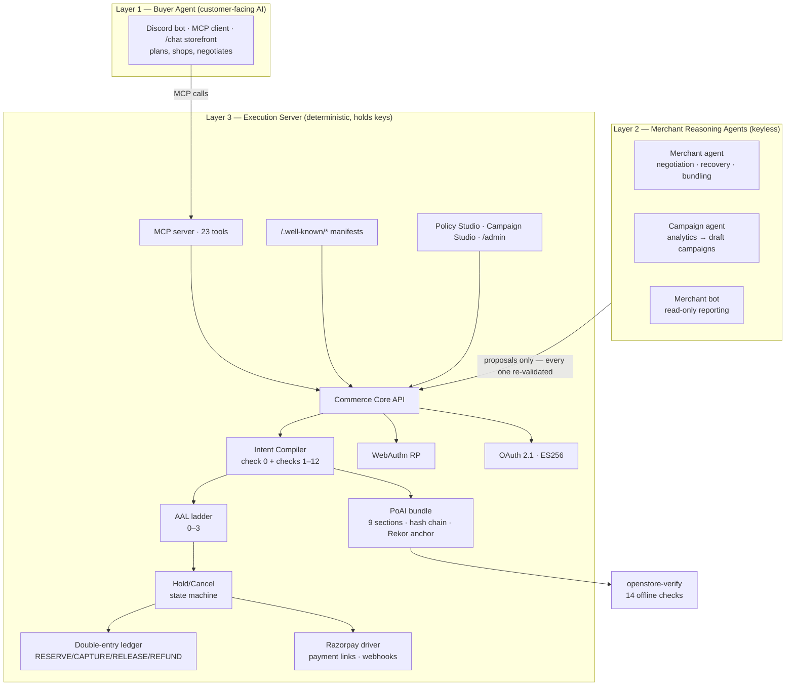
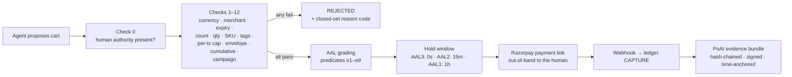

# OpenStore

**An open-source agentic storefront framework. Self-host it beside the store you already have, and any AI agent can browse, cart, and check out — under spending rules a human signs, with money the agent can never touch, and a receipt no one can dispute.**

[](LICENSE)
[](pyproject.toml)
[](https://github.com/ApxllxCartxr/OpenStore/actions/workflows/ci.yml)
[](#self-hosting)

```bash
uv sync
uv run openstore init --merchant "Gelateria Milano" --currency INR
uv run openstore serve gelateria.yaml
```

Three commands, **no API keys and no account required**. Migrations run on first boot and the store comes up serving a discovery manifest, a UCP capability manifest, an agent-readable catalog, 23 MCP commerce tools over JSON-RPC, checkout, hold/cancel, a signed campaign feed, a browser storefront at `/chat`, and a cryptographic evidence trail for every rupee that moves. Add Razorpay test-mode keys when you want money to actually move.

**There is no hosted OpenStore.** No SaaS tier, no signup, no usage billing, no phone-home — there is no OpenStore service to phone. You run the process, you hold the keys, the database is yours, and MIT means you can fork it and never speak to this repo again.

**Jump to:** [What you get](#what-you-get-out-of-the-box) · [Why self-hosted](#why-a-framework-and-why-self-hosted) · [Trust contract](#the-trust-contract) · [Growth](#the-growth-half) · [Architecture](#architecture) · [Receipt](#the-receipt-proof-of-authorized-intent) · [Extending it](#extending-it) · [Self-hosting](#self-hosting) · [Status](#status--roadmap) · [Contributing](#contributing)

---

## What you get out of the box

Three jobs, one sidecar process:

1. **Makes your store transactable by an AI buyer, end to end** — discovery manifests, agent-readable catalog with signed attestations, 23 MCP tools (JSON-RPC wire-conformant, so stock clients like MCP Inspector work), deterministic checkout, hold/cancel, Razorpay payment links, webhooks with reconciliation, and an anonymous browser storefront at `/chat`.
2. **Grows revenue, not just processes sales** — aggregate analytics, human-gated campaign orchestration, deterministic cross-sell, a read-only merchant bot, and an autonomous loop that drafts (never activates) campaigns for stalled SKUs.
3. **Leaves behind a receipt no one can dispute** — every completed order assembles a 9-section evidence bundle a third party can verify offline with nothing but a browser.

The one rule across all three: **reasoning and money never share a process boundary.** LLM output is a proposal, never a command. Agents are keyless and proposal-only; the deterministic core re-validates everything server-side.

---

## Why a framework, and why self-hosted

### The capability exists — bilaterally

AI-mediated commerce is not hypothetical. Agentic payment pilots are live; large platforms are wiring conversational ordering into their apps today. It works **bilaterally** — a negotiated integration between one large platform and one large merchant, with custom endpoints, a shared roadmap, an account manager and a legal review. You are inside the integration or outside it, and the cost of being inside is a scale most merchants will never have.

OpenStore is that same channel, **decoupled and given away**: a sidecar you run beside the store you already have, with no counterparty to negotiate with, no platform to be admitted to, no code to migrate, and no vendor who can reprice, deprecate, or de-platform you. The gelateria with 40 SKUs gets the integration the enterprise negotiated for.

### What being self-hosted actually buys you

- **Your keys stay yours.** PSP credentials, signing keys and the customer database live in your process and your DB. Nothing is escrowed with a third party — including this project.
- **Your evidence is portable.** Bundles are hash-chained, merchant-signed and verifiable offline by anyone. If you stop running OpenStore tomorrow, every receipt you ever issued still verifies.
- **Your LLM choice is yours.** The provider layer is a registry with failover: OpenAI-compatible, native Anthropic, Groq, Gemini — or point the OpenAI-compatible base URL at Ollama or vLLM and run the agent layer with no cloud LLM at all.
- **No mandatory network dependency for trust.** Rekor time-anchoring is preferred, but a local Merkle fallback is a first-class path — a store with no Sigstore reachability still produces valid bundles.

### What bilateral integrations still don't give anyone

**Nothing to hand an arbitrator.** When the customer says *"I never authorized that"* ninety days later, the evidence is whatever the platform's logs say it is — a claim by an interested party, in a format only that party can produce, verifiable only by trusting them. Every protocol in the current race (ACP, UCP, AP2, x402, TAP, Agent Pay, NPCI UAP) answers *how does an agent pay?* None answers *what does the merchant hand an arbitrator?* OpenStore's answer is the **PoAI bundle**: hash-chained, merchant-signed, time-anchored, checkable offline by anyone — including someone who thinks the merchant is lying.

**Nothing that grows the merchant.** A payment integration makes a merchant *transactable*. It does not tell them which SKU has stalled, draft the campaign that fixes it, or put that offer where an AI buyer will find it. Agentic commerce that only handles checkout has automated the last five seconds of the funnel.

| The protocols make a merchant... | OpenStore makes a transaction... |
|---|---|
| transactable (ACP, UCP) | **defensible** (PoAI bundles, offline-verifiable) |
| payable (AP2, TAP, Agent Pay) | **bounded** (human-signed compiler, not vibes) |
| discoverable (manifests, feeds) | **governed** (AAL ladder: stronger proof → faster fulfillment) |

Where it overlaps, it interoperates rather than competes. The sidecar serves MCP at `/agent/mcp` and a **UCP** capability manifest at `/.well-known/ucp` — declaring only what it actually implements. The authorization model landed on the same shape **AP2** later specified: a signed `IntentPolicy` is structurally an Intent Mandate, a per-cart assertion a Cart Mandate. The difference is what enforces them — a deterministic compiler whose transcript is replayable, rather than a credential a merchant is trusted to honour.

**x402 is deliberately not on the roadmap.** It solves stablecoin micropayments between machines; this is an INR/UPI stack for human-authorized purchases. There is no honest integration story, so there isn't one. For the same reason the manifest no longer advertises ACP: the entry pointed at a version ACP never published and an endpoint that returns `not implemented` (DECISION-026). **A manifest is a promise; only working capabilities belong in it.**

---

## The trust contract

Every money action is explainable, bounded and gated, with an audit trail and failures handled gracefully:

| Promise | How | Where |
|---|---|---|
| **Explainable** | Every decision emits an ordered, byte-stable transcript of 13 named checks and a closed-set reason code. No LLM in the decision path. | `core/compiler.py` |
| **Bounded** | Spend caps per transaction, per envelope and cumulative; SKU allowlists, tag rules, merchant lock, expiry — all from a policy the human signed. | `core/compiler.py`, `core/policy_signing.py` |
| **Gated** | WebAuthn user-verified signature required before any order exists. AAL0 (no verifiable authority) creates no order at all. | `core/webauthn_rp.py`, `core/aal.py` |
| **Audit trail** | 9-section PoAI bundle, SHA-256 hash-chained, ES256-signed, Rekor-anchored, verified offline by 14 checks. Two bundles are [checked into this repo](docs/demo_assets) so you can run it now. | `core/poai.py`, `verify/` |
| **Failures, gracefully** | Four paths, all tested — denied cart, tampered receipt, crash mid-payment, hostile webhook. | below |

The four failure paths:

- **A denied cart** → `policy.tag_violation`, then the merchant agent negotiates in the same DM thread, and when no in-policy path exists it drafts a policy amendment the human approves with a second passkey tap. The cart recompiles against an unpersisted, relieved policy snapshot — the standing signed policy is never mutated.
- **A tampered receipt** → the verifier names the broken hash-chain link and exits 1.
- **A crash mid-payment** → idempotency fingerprinting detects the in-flight call on restart and **adopts the existing Razorpay object instead of creating a second one** (`core/idempotency.py`).
- **A hostile webhook** → HMAC on raw bytes, replay dedupe, out-of-order tolerance, dead-letter queue, and a sweeper that reconciles against Razorpay as the source of truth (`core/webhooks.py`).

---

## Architecture

Three layers, one hard rule: **reasoning and money never share a process boundary.**



**Why agents are safe here (R0.9/R0.10):** every agent-produced artifact passes through the same deterministic validators as input from a stranger. The agent modules physically cannot import payment or signing code — enforced by an import-firewall test (`tests/sentinel/test_import_firewall.py`). A hallucinating or prompt-injected agent can only ever produce a suggestion that gets rejected.

### The money path

Nothing reaches the PSP without surviving all of this, in order:



- **Deterministic compiler** (`core/compiler.py`) — `human_authority_present` plus 12 checks, fixed order, stop-at-first-failure, byte-stable transcript.
- **Idempotency as a contract** (`core/idempotency.py`) — fingerprinted keys, in-flight detection, crash-mid-API-call recovery that adopts the existing PSP object instead of double-charging.
- **Double-entry ledger** (`core/ledger.py`) — append-only; escrow accounts net to zero at terminal states; reversals, never edits.
- **Webhooks that expect betrayal** (`core/webhooks.py`) — HMAC on raw bytes, dedupe, out-of-order tolerance, dead-letter + alerts, and a sweeper that reconciles against the PSP as the source of truth.

### The AAL ladder — evidence-graded trust

| Level | What it means | Hold |
|---|---|---|
| **AAL3** | The human's authenticator signed **this exact cart** | 0s — fulfill now |
| **AAL2** | Fresh signed standing policy + clean compile | 15 min cancel window |
| **AAL1** | Authority presented but freshness/attestation predicates failed | 1 hour hold |
| **AAL0** | No verifiable human authority | **No order is created** |

Fulfillment keys off `RELEASED`, never order creation. The cancel link is a single-use 32-byte capability token delivered only to the customer.

---

## The receipt: Proof of Authorized Intent

Every completed transaction assembles a **9-section evidence bundle**: what was bought, who authorized it (the WebAuthn-signed policy + assertion), what the agent intended, what the compiler decided (with a re-runnable transcript), what the human was told, and the AAL grading. Sections are SHA-256 hash-chained, the root is ES256-signed by the merchant, and the root is time-anchored to Sigstore's Rekor transparency log (with a local Merkle fallback).

The point: **verification doesn't require trusting the merchant** — or this project.

Both bundles below are checked into [`docs/demo_assets/`](docs/demo_assets) — one clean, one with a single digit of `amount_minor` flipped from `21000` to `99999`. Real output; run it yourself, offline, right after `uv sync`:

```console
$ uv run openstore-verify docs/demo_assets/bundle.json --merchant-jwks docs/demo_assets/jwks
bundle: poai_test_bundle_aal2 (PoAI 0.1)
AAL level: 2
  [PASS] schema
  [PASS] chain_integrity
  [PASS] merchant_signature
  [PASS] time_anchor
  [PASS] webauthn_assertion
  [PASS] challenge_binding
  [PASS] uv_flag
  [PASS] catalog_attestations
  [PASS] compiler_digest
  [PASS] re_execution
  [PASS] amount_consistency
  [PASS] aal — level=2
  [PASS] delegation_chain — no delegation (root policy)
  [PASS] spend_chain — no delegation (root policy)
$ echo $?
0
```

One digit changed, and two independent checks catch it — the hash chain and the arithmetic:

```console
$ uv run openstore-verify docs/demo_assets/bundle_tampered.json --merchant-jwks docs/demo_assets/jwks
  [FAIL] chain_integrity — link[0] (transaction): hash mismatch (section=transaction, link_index=0)
  [FAIL] amount_consistency — amount_minor mismatch: transaction=99999, computed from items=21000
$ echo $?
1
```

The Evidence Viewer (`/orders/{checkout_id}/evidence/view`) re-implements the same 14 checks in a single zero-dependency HTML page using browser WebCrypto — an arbitrator needs nothing but a browser.

---

## The growth half

Making a store transactable is table stakes. These are the parts that make it *more money*, each one an agent proposing something a human or a compiler has final say over.

**Aggregate analytics, not raw orders.** `core/campaigns.py::get_analytics_view` is the **only** input the campaign agent ever receives: per SKU, `units_sold_7d`, `units_sold_30d`, `gross_minor_30d`, `attach_rate`, `last_sold_at`. No buyer identities, no payment data, no raw order rows (INV-14). The privacy boundary is a function signature, not a prompt asking the model to behave.

**Campaign orchestration, human-gated.** The agent drafts, a deterministic validator checks the draft, and it publishes only after a merchant passkey approval bound to that specific campaign. Then the crucial part: **the discount is never taken on the offer's word.** Compiler check 12 recomputes it server-side at checkout, so a campaign that expired, was paused, or was tampered with in transit simply doesn't apply. Approved offers are signed into `/.well-known/agent-campaigns.json`, where buyer agents discover them and re-plan.

**The autonomous growth loop.** A background task inside every `openstore serve` process watches for stalled SKUs — 30-day units below a configured floor — drafts a campaign unprompted, and after the window closes compares before/after units sold so the next draft is informed by the last one's outcome. It proposes; it never activates. Every draft lands in `PENDING_APPROVAL` waiting for a passkey (DECISION-034).

**Cross-sell that can't hallucinate a product.** Related items come from `related_skus` in your catalog via a deterministic lookup (`surfaces/catalog.py::suggest_related_items`). The LLM chooses the words around it; it cannot invent a SKU, a price or a discount, because the suggestion never re-enters the compiler's decision path.

**A merchant bot for the stats.** DM `openstore merchant-bot` for campaign status, exposure against policy caps, recent orders and suggestions. Its action set is a **frozenset of five** — `campaign_status`, `exposure`, `recent_orders`, `suggest_campaign`, `unknown` — and contains no mutating action **by construction, not by prompt instruction**, so no amount of prompt injection makes it approve, activate, pause or cancel anything.

```bash
uv run openstore campaign draft configs/chai.yaml         # agent drafts from analytics
uv run openstore campaign list configs/chai.yaml          # DRAFT / PENDING_APPROVAL / ACTIVE / PAUSED
uv run openstore campaign pause configs/chai.yaml <id>
uv run openstore campaign check-growth configs/chai.yaml  # run the stall detector on demand
```

---

## The agent layer

Five agent surfaces ship in the package. All keyless, all proposal-only, none able to move money:

- **Buyer agent** (`agents/buyer_graph.py`) — a LangGraph loop behind a Discord DM or the `/chat` storefront: goal → search → policy-aware cart → checkout → hold monitoring, with free-text handling for menu, cart, order status and cancellation. It searches **every merchant it is enrolled with** over HTTP MCP and builds one cart tagged per line with `merchant_id`.
- **Merchant agent** (`agents/merchant_agent.py`) — negotiates over structured counter-offers; when no in-policy path exists, drafts a **signed policy amendment** that only activates with a human's passkey tap.
- **Campaign agent** (`agents/campaign_agent.py`) — drafts from the aggregate analytics view.
- **Growth-trigger loop** — stall detection, unprompted drafting, outcome feedback into the next draft.
- **Merchant bot** (`agents/merchant_bot.py`) — read-only reporting over a five-action frozenset.

Supporting conversational plumbing: **shopping sessions** (`core/shopping_session.py`) park a chat exchange between messages with a short TTL, resumed by the buyer's next message rather than a token; **handoffs** (`core/handoff.py`) park an out-of-band ceremony resumed by a signed web-link click; and the **buyer enrollment aggregator** (`surfaces/buyer_studio.py`) lists signing links for several unenrolled merchants at once — while holding no signing authority itself, because there is no signing hub (DECISION-022).

---

## Extending it

The seams that are real today, with the extension point named:

| Seam | Extension point | Status |
|---|---|---|
| **Catalog source** | `surfaces/catalog.py::load_catalog` — one access point returning a normalized item shape (`sku`, `unit_minor`, `tags`, `related_skus`). Nothing above it knows the source. | YAML and Shopify (read-only, runtime token mint, paise-exact, non-INR fails closed). WooCommerce / Postgres are the same signature away. |
| **LLM provider** | `agents/llm.py::register_provider` + `FailoverProvider` chain | OpenAI-compatible, native Anthropic, Groq, Gemini, and a network-free `Dummy` for tests. Point the OpenAI base URL at Ollama/vLLM for a fully local agent layer. |
| **Chat platform** | `chat_platform` / `chat_user_id` on checkouts and handoffs; Discord is one driver, not a hard dependency | Discord ships; the identity plumbing is platform-agnostic, so WhatsApp/web drivers slot in without touching the money path. |
| **Identifiers** | `REGISTRY.json` — every reason code, route, tool name and enum value | Machine-enforced both directions: code containing an unregistered identifier fails the build (`scripts/registry_diff.py`). Add a capability, register it. |
| **Payments** | `psp/router.py` + `psp/razorpay_driver.py` | **Razorpay only today.** The webhook router and driver are separate, but there is no abstract PSP interface yet — a second PSP means extracting one. Honest state, not a plug-in promise. |

---

## Self-hosting

### A fresh sidecar for your own store

```bash
uv sync
uv run openstore init --merchant "Gelateria Milano" --currency INR
```

That writes `gelateria.yaml`, `catalog.yaml` and `.env.example`. Fill in the catalog:

```yaml
catalog:
  - sku: "GEL-VAN-500"
    name: "Madagascar Vanilla 500ml"
    unit_minor: 21000            # ₹210.00 — integer paise, always
    tags: ["vegan", "dairy-free"]
    related_skus: ["GEL-HAZ-500"]   # deterministic cross-sell
    description: "Slow-churned, cashew-base vanilla."
```

```bash
uv run openstore serve gelateria.yaml
```

This works with **no `.env` at all** — the server applies migrations and comes up serving `/.well-known/agent-commerce.json`, `/.well-known/ucp`, `/agent/catalog`, `/agent/mcp`, the signed campaign feed, the `/chat` storefront, Policy Studio (`/intent/studio`), Campaign Studio (`/campaign/studio`), `/admin/orders`, `/admin/campaigns`, `/admin/agents` and the Evidence Viewer. Add Razorpay **test-mode** keys (and an LLM key for the agent layer) when you want live checkout. Open Policy Studio, enrol a passkey, sign your first `IntentPolicy` — and you're transactable.

Verify a completed order's evidence, offline:

```bash
curl http://localhost:8000/orders/<checkout_id>/evidence -o bundle.json
uv run openstore-verify bundle.json --merchant-jwks <(curl -s http://localhost:8000/.well-known/poai-jwks.json)
```

### Production

`Dockerfile` + `docker-compose.yml` bring up Postgres 16 (one database per merchant) with migrations at boot, `/health/live` + `/health/ready` gates, Prometheus metrics at `/internal/metrics`, Discord trace channels (`#buyer-trace`, `#merchant-trace`, `#money-trace`, `#alerts`) and an operator blast-radius view at `/internal/policy/blast-radius`. Full runbook — Compose, Postgres, health gates, live-key ceremony — in [`docs/DEPLOY.md`](docs/DEPLOY.md). SQLite stays the local-dev default. Requirements: Python 3.12, a public HTTPS origin for WebAuthn (`rp_id`/origin binding fails boot loud on mismatch), and Postgres for production.

> Packaged as `openstore` with three entry points (`openstore`, `openstore-verify`, `openstore-buyer`), **not yet published to PyPI** — run it from this repo with `uv`.

### This repo's demo instance

Two merchants (Gelateria Milano on `:8000`, Chai House on `:8001`), a federated buyer process, and a merchant reporting bot. Full boot sequence — secrets, migrations, OAuth client registration, analytics seeding — in [`docs/RUN.md`](docs/RUN.md).

```bash
uv run openstore serve configs/gelateria.yaml --port 8000
uv run openstore serve configs/chai.yaml --port 8001
uv run openstore-buyer configs/buyer.yaml
uv run openstore merchant-bot configs/gelateria.yaml configs/chai.yaml
```

Federation note: each merchant holds its own signed policy and there is no signing hub, so there is no shared budget to double-spend (DECISION-022). An optional operator-declared total (`federation_total_cap_minor`) sums fresh per-policy exposures plus merchant-computed pendings before any payment link is created, and blocks the whole commit on breach.

---

## Security model

- **Credential absence, not credential discipline** — agents can't leak keys they never had (import-firewall tested).
- **WebAuthn** — full FIDO2 relying party: ES256/RS256 only, UV-flag enforcement, sign-count regression detection, challenge-bound ceremonies. A virtual authenticator (`devtools/virtual_authenticator.py`) drives the ceremonies in tests without hardware.
- **OAuth 2.1 + PKCE** — asymmetric ES256 tokens; the validator pins `alg` and verifies the JWS signature against the merchant JWKS before trusting any claim (`alg: none` and algorithm-confusion tokens are rejected — red-team tested).
- **Closed sets everywhere** — `REGISTRY.json` holds every reason code, route, tool name and enum; unregistered identifiers fail the build.
- **Fail loud** — no silent catches, no coercions, no retries of non-retriable errors. Every rejection carries a reason code that ends up in signed evidence.
- **Money is integers, time is UTC** — paise only, no floats; RFC 3339 everywhere (two grandfathered Unix-second exceptions, documented).

**Tested adversarially:** cart-swap, forged tokens, WebAuthn replay, idempotency-key reuse, ledger manipulation, webhook forgery/replay/reorder, OAuth algorithm confusion, prompt injection, spend-cap race conditions (TOCTOU), cross-merchant isolation, PII leakage into traces, agent compiler-bypass attempts. Golden fixtures pin every cryptographic output byte-for-byte.

---

## For agent builders

A third-party agent can find and call the store today:

- `/.well-known/agent-commerce.json` (endpoints, OAuth scopes, evidence + campaign feeds), `/.well-known/ucp` (real capabilities only), `/.well-known/agent-campaigns.json` (signed offers), `/agent/catalog` (attested items + live offers), `/.well-known/poai-jwks.json` (verification keys), and `/protocols/{name}/spec-excerpt` for the excerpt behind each declared protocol.
- OAuth 2.1 `client_credentials` at `/oauth/token` with ES256 and scope-gated tools (`catalog:read`, `cart:write`, `checkout:initiate`, `checkout:confirm`).
- 23 tools behind one JSON-RPC 2.0 endpoint: `initialize` (pinned `2025-06-18`), `tools/list` with per-tool `inputSchema`, `tools/call` with `isError` content carrying closed-set reason codes. UCP MCP binding names (`search_catalog`, `lookup_catalog`) are aliased and advertised. Point MCP Inspector at `/agent/mcp` — it lists and calls.
- `tests/GOLDEN/conformance/` pins the wire bytes byte-for-byte (initialize, all 23 tool schemas, UCP catalog shapes, error envelopes, both discovery manifests) — replay and verify instead of trusting the manifest.

What still needs custom code, and why, is in [Status & roadmap](#status--roadmap).

---

## Status & roadmap

The money path is pilot-grade and overbuilt on purpose; everything around it still has seams. Nothing here is hidden.

**Solid:** compiler · ledger · idempotency · hold/cancel · webhooks + reconciliation · WebAuthn ceremonies · OAuth with signature-pinned validation · per-merchant signing keys · PoAI bundles + offline verifier + tamper detection · 23 MCP tools with pinned conformance fixtures · discovery manifests · catalog attestations · campaign pipeline · autonomous growth loop · federated multi-merchant shopping with a consolidated budget guardrail · Shopify read-only catalog · anonymous `/chat` storefront with browser checkout · Docker + Postgres + health gates.

**Where friction still lives:**

| Who | Smooth today | Friction |
|---|---|---|
| **Merchant (onboarding)** | `init` + `serve`, migrations on boot, studios served, no keys to explore | Needs a terminal, public HTTPS origin, Postgres for prod, and pasted secrets. No hosted option by design — but also no click-to-deploy yet. |
| **Merchant (catalog)** | YAML in 60 seconds; Shopify read-only against a real dev store | WooCommerce / Postgres / Tally adapters don't exist. No stock sync, no order write-back, no GST invoice, no Shiprocket/Delhivery, no COD, no returns/RTO. |
| **Buyer** | Discord DM or `/chat` in the browser — cart → passkey tap → pay link → status/cancel, no login, no cookies | No WhatsApp surface. Payment leaves the conversation (hosted link). Passkeys need HTTPS and a compatible device. |
| **Agent builder** | Manifests + OAuth + 23 tools with schema discovery + signed offer feed + conformance fixtures | UCP REST binding, AP2 wire mandates and open enrollment (DCR) are still ahead. |
| **Operator** | Compose + Postgres, health gates, metrics, trace channels, runbook | One process + one DB per merchant — 100 merchants is 100 processes, no orchestrator. Sustained live-mode load, key rotation and backup-restore are runbook text, not drilled practice. |

**Roadmap, roughly in order:**

1. **UCP REST binding** — `POST /checkout-sessions`, `PUT`, `/complete`, `UCP-Agent` header, `continue_url` handoff, payment-handler negotiation, SLOs. ~6–10 weeks plus feed work. The price of showing up inside AI Mode / Gemini.
2. **Inventory + order write-back** — reserve on hold, decrement on capture, release on cancel, push status back to the merchant's OMS. Without it, oversell protection is one-sided. ~2–3 weeks.
3. **Indian checkout reality** — UPI-intent/QR prominence, COD as a first-class non-prepaid path, GST invoice with HSN split, Shiprocket/Delhivery handoff. ~2–4 weeks.
4. **More catalog adapters** — WooCommerce and Postgres, 1–2 weeks each against the existing seam.
5. **WhatsApp buyer surface** — BSP driver on the existing chat-identity plumbing. ~3–6 weeks.
6. **Open enrollment** — dynamic client registration (RFC 7591) and the authorize-code loop (`/oauth/authorize` is advertised but unimplemented; only `client_credentials` works), plus abuse and rate-limit thinking. ~2–3 weeks.
7. **AP2 wire adapter** — real VDCs, merchant-signed Checkout JWT, Payment Mandate flow, minted *alongside* PoAI rather than instead of it.
8. **A second PSP** — which means extracting a real driver interface first.
9. **Frontend polish** — the studios, `/admin` and the Evidence Viewer are functional but utilitarian.

Live Razorpay capture at scale remains untested: the driver is golden-pinned and exercised against real test-mode payment links, but sustained live traffic is not, and `Q-007` live-constant capture still gates production.

---

## Project structure

```
src/openstore/
├── core/           # the money path: compiler, ledger, AAL, PoAI, WebAuthn, OAuth, audit, campaigns
├── surfaces/       # MCP server, well-known manifests, studios, catalog, /chat, web cart, evidence viewer
├── agents/         # buyer · merchant · campaign · merchant bot (keyless, proposal-only) + LLM providers
├── psp/            # Razorpay driver + webhook router
├── verify/         # openstore-verify — 14 offline checks, exit codes 0–4
├── devtools/       # virtual authenticator for hardware-free WebAuthn tests
├── models.py       # SQLModel schemas
├── server.py       # FastAPI app factory + background tasks (hold expiry, growth loop)
├── config.py       # merchant config (closed key set; unknown keys hard-error)
├── notifier.py     # Discord trace channels (no keys, no signing material)
├── cli.py          # openstore init / serve / campaign / orders / merchant-bot
└── buyer_cli.py    # openstore-buyer — the federated buyer process

configs/            # this repo's demo instance: two merchants + the buyer
docs/demo_assets/   # a clean PoAI bundle, a tampered one, and the merchant's public JWKS
tests/              # stage tests · golden tests · red team · sentinels
tests/GOLDEN/       # byte-pinned fixtures: compiler · ledger · PoAI · WebAuthn · canonical · conformance
docs/SPECS/         # the written stage contracts this was built from
REGISTRY.json       # every closed set, machine-enforced both directions
```

### Documentation

| File | What it is |
|---|---|
| [`docs/OPENSTORE_PRD_v3.md`](docs/OPENSTORE_PRD_v3.md) | the requirements doc everything was built from |
| [`docs/SPECS/`](docs/SPECS) | twelve stage contracts, each a testable slice (later stages shipped against numbered decisions in `DECISIONS.md`) |
| [`docs/DECISIONS.md`](docs/DECISIONS.md) | numbered architectural decisions, and why the alternatives lost |
| [`docs/OPEN_QUESTIONS.md`](docs/OPEN_QUESTIONS.md) | what's still unresolved, honestly |
| [`docs/RUN.md`](docs/RUN.md) | how to boot the two-merchant demo |
| [`docs/DEMO_SCRIPT.md`](docs/DEMO_SCRIPT.md) | a 6-minute walkthrough, beat by beat |
| [`docs/DEPLOY.md`](docs/DEPLOY.md) | production runbook: Compose, Postgres, health gates, live-key ceremony |
| [`CONTRIBUTING.md`](CONTRIBUTING.md) | setup, the checks, and the two rules that gate every PR |

---

## Contributing

Issues and PRs welcome. Two rules make review fast:

1. **Identifiers are law.** New reason codes, routes, tool names and enum values go in `REGISTRY.json` first — `scripts/registry_diff.py` fails the build otherwise, in both directions.
2. **Nothing bypasses the compiler.** Agent code may not import payment or signing modules; `tests/sentinel/test_import_firewall.py` enforces it.

Full setup, the money-path house rules, and where new code goes: [`CONTRIBUTING.md`](CONTRIBUTING.md).

### Running the checks

```bash
uv run pytest -q                        # 741 tests
uv run mypy src/                        # 53 source files, strict, clean
uv run ruff check src/ tests/
uv run python scripts/registry_diff.py  # must print nothing, exit 0
```

No live credentials needed — the suite mocks Razorpay, Discord and the LLM providers, and runs on temp SQLite.

---

## Built with

Python 3.12 · FastAPI · SQLModel · SQLite (`BEGIN IMMEDIATE`) · Alembic · Postgres 16 · Razorpay test mode · WebAuthn (`py_webauthn`) · ES256 JWS · Sigstore Rekor · LangGraph · discord.py · uv

Originally built as a Razorpay Buildathon entry (Track 01 — *AI Growth & Agentic Commerce*) by [Joseph Fernando](https://github.com/ApxllxCartxr), and opened up because the capability it demonstrates shouldn't require a negotiated integration to get. The PRD and stage specs in `docs/` are arguably the real product.

## License

[MIT](LICENSE) — use it, fork it, run it commercially, no strings.
