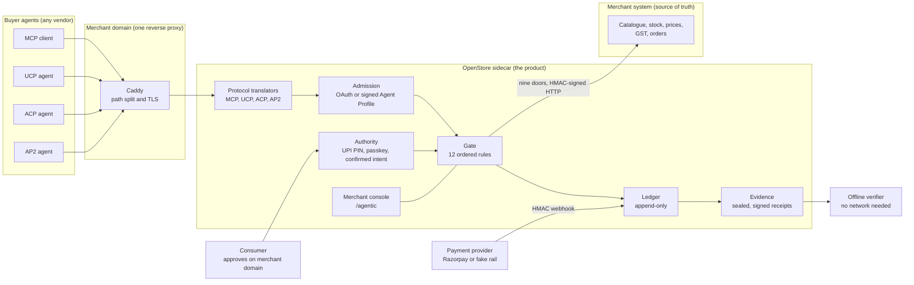
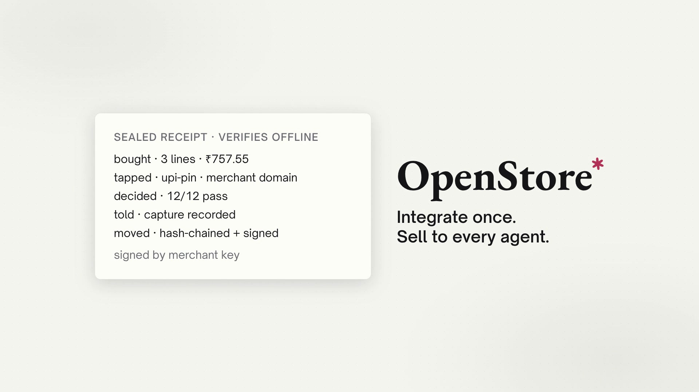

# OpenStore: Open-Source Storefronts for AI Agents


OpenStore is a self-hosted sidecar (a service that runs next to an existing shop) that makes one merchant site transactable by any AI buyer agent.
It translates MCP, UCP, ACP, and AP2 into one money core, so a merchant integrates once instead of once per protocol.
Agents can search, build a basket, and start a checkout, but only a human tap on the merchant domain moves money. Every order ends in a signed receipt that anyone can verify offline.

---

## Contents

1. [Background](#background)
2. [What OpenStore is, and what it is not](#what-openstore-is-and-what-it-is-not)
3. [Architecture](#architecture)
4. [Features](#features)
5. [The product and the demo surfaces](#the-product-and-the-demo-surfaces)
6. [Quickstart](#quickstart)
7. [Development](#development)
8. [Verify a receipt](#verify-a-receipt)
9. [Scope and limits](#scope-and-limits)
10. [Status](#status)
11. [Documentation](#documentation)

---

## Background

### Agents now buy things for people

AI assistants moved from product discovery to product purchase. A user asks an assistant for groceries, and the assistant finds items, builds a cart, and starts a payment. This changes a basic assumption of online payments. For thirty years, a human was present at the moment of purchase. Chargeback rules, dispute processes, and liability frameworks all rest on that presence.

An agent is not the human. It can act minutes or weeks after the last instruction, on a loose request such as "restock my kitchen under four thousand rupees". Every party in the payment chain now needs an answer to three questions. Did a human approve this exact purchase? Was the item the item the merchant offered? What evidence exists when the order goes wrong?

### The industry is building the infrastructure now

The largest companies in AI, commerce, and payments entered this field in the last two years. Each one published a protocol or a program.

| Organization | Contribution | What it does |
|---|---|---|
| Anthropic | [Model Context Protocol (MCP)](https://www.anthropic.com/news/model-context-protocol), November 2024 | An open standard that connects AI assistants to external systems. It is now the default way for an agent to call a tool. |
| OpenAI and Stripe | [Agentic Commerce Protocol (ACP)](https://stripe.com/newsroom/news/stripe-openai-instant-checkout), 2025 | Powers Instant Checkout in ChatGPT. Stripe issues a Shared Payment Token that is scoped to one merchant and one cart total. |
| Google | [Agent Payments Protocol (AP2)](https://cloud.google.com/blog/products/ai-machine-learning/announcing-agents-to-payments-ap2-protocol), 2025 | Signed mandates that record what a user authorized. Google developed it with more than 60 organizations, including Mastercard, American Express, PayPal, Adyen, and Coinbase. |
| Shopify and Google | [Universal Commerce Protocol (UCP)](https://www.shopify.com/news/ai-commerce-at-scale), 2026 | An open standard for agents to transact with merchants over REST, MCP, AP2, or A2A. More than 20 retailers and platforms endorse it. |
| Coinbase | [x402 extension for A2A](https://cloud.google.com/blog/products/ai-machine-learning/announcing-agents-to-payments-ap2-protocol) | Agent-to-agent payments in stablecoins over HTTP status 402. |
| Visa | [Visa Intelligent Commerce](https://www.visa.com/en-us/solutions/intelligent-commerce) | Payment credentials, controls, and authentication for AI-initiated transactions, plus the Trusted Agent Protocol and an MCP server. |
| Mastercard | [Mastercard Agent Pay](https://www.mastercard.com/us/en/news-and-trends/press/2025/april/mastercard-unveils-agent-pay-pioneering-agentic-payments-technology-to-power-commerce-in-the-age-of-ai.html), April 2025 | Mastercard Agentic Tokens, built on its existing tokenization for card-on-file and passkeys. |
| NPCI, Razorpay, and OpenAI | [Agentic Payments on ChatGPT](https://razorpay.com/newsroom/razorpay-npci-and-openai-come-together-to-launch-agentic-payments-ushering-in-ai-driven-commerce-at-national-scale/), October 2025 pilot | UPI payments inside ChatGPT, built on UPI Reserve Pay. Bigbasket is among the first merchants. |
| NPCI and Razorpay | [Agentic Payments on Claude](https://razorpay.com/blog/agentic-payments-and-npci/), February 2026 pilot | UPI payments inside Claude for orders from Zomato, Swiggy, and Zepto. |

This list shows that agentic commerce is not a research topic. Model providers, card networks, payment processors, commerce platforms, and the operator of the Indian national payment rail all build for it.

### The merchant side carries the cost

Most of this work serves the buyer side: better assistants, shorter checkouts, fewer taps. The merchant side receives much less attention. A merchant who wants agent traffic must do this work for each platform:

- Publish a catalogue feed in the format of that platform.
- Build a checkout endpoint for the protocol of that platform.
- Register as a merchant with that platform.
- Sign a commercial agreement with that platform.

Stripe states the problem directly: "with many AI agents emerging, it's not realistic for businesses to maintain integrations with each one" ([Stripe](https://stripe.com/newsroom/news/stripe-openai-instant-checkout)). Large platforms solve this for merchants inside their own catalogue. A WooCommerce store, a custom site, or a small shop with its own stack must build each integration or stay invisible to agents.

### India adds a hard constraint

The Reserve Bank of India requires an Additional Factor of Authentication (a second proof of identity, such as a UPI PIN) for digital payments. Designs that give an agent a delegated card credential do not map cleanly onto UPI, where no card exists to delegate. An honest design for Indian rails treats the human approval step as a requirement, not as friction to remove.

---

## What OpenStore is, and what it is not

OpenStore is not a new protocol. The protocols above already exist, and OpenStore does not compete with them.

OpenStore is a translation layer that fits any merchant. It speaks the published protocols on behalf of the merchant, and it maps every protocol onto one money core. The merchant connects its shop to OpenStore once, through a fixed contract of nine HTTP endpoints. After that, agents reach the shop over whichever protocol they speak.

| OpenStore is | OpenStore is not |
|---|---|
| A sidecar that one merchant runs on its own domain | A marketplace, a hosted mall, or a ranked search engine |
| A translator for MCP, UCP, ACP, and AP2 over one money core | A new protocol or a competitor to the published protocols |
| A deterministic authorizer that the merchant policy controls | A payment processor or a holder of customer funds |
| A producer of signed receipts that anyone can verify offline | A platform that the merchant must trust or pay per order |

This design gives the merchant three results:

- The merchant does not build a separate integration for each protocol.
- The merchant keeps the customer, the catalogue, the prices, and the settlement.
- The merchant does not hand spending authority to a language model.

---

## Architecture



### How the parts fit

- Every protocol request passes through its translator. The translator accepts only a well-formed envelope for that protocol, calls the shared core, and translates the answer back. The core Transcript bytes are identical for every protocol.
- The Gate is the only path to money. No second checkout, ledger, or receipt exists anywhere in the system.
- The merchant system stays the source of truth. The sidecar reads catalogue, stock, and prices through the nine doors at each decision. It never stores product data of its own and never computes a price.
- The consumer approves each spend on the merchant domain, not inside the agent.
- The payment provider settles money directly into the merchant account. OpenStore never holds funds.

### How a purchase flows

1. An agent searches the catalogue, builds a basket, and starts a checkout. It cannot complete the checkout.
2. The merchant prices the basket through door 9 (`quote`). The Quote contains the subtotal, discounts, shipping, GST lines, and the total in paise.
3. The agent shows the consumer a one-time approve URL. The consumer approves the exact total on the merchant domain with a UPI PIN or a passkey.
4. The Gate runs its twelve rules. Immediately before money moves, it fetches the Quote again and compares the bytes with the Quote that the consumer approved.
5. The provider settles the payment. The Ledger records the capture. The sidecar seals the receipt.
6. Anyone verifies the receipt offline. The receipt states which kind of approval it carries.

### Request routing

One deploy serves one merchant domain ([ADR-0007](docs/adr/0007-single-merchant-sidecar.md)). Five services share one origin behind one reverse proxy.

| Path | Served by | Access |
|---|---|---|
| `/`, `/shop`, `/p/<slug>`, `/lookup` | merchant site | public |
| `/.well-known/*` | sidecar | public |
| `/agent/*` | sidecar | agent token, rate-limited by tier |
| `/agentic/approve` | sidecar | one-time tap token |
| `/agentic/*` | sidecar | merchant session |
| `/receipt/<id>` | sidecar | public, the unguessable id is the only credential |
| `/provider/*` | sidecar | public, HMAC on the request body |
| `/trait/*`, `/admin*` | none | refused at the edge, private network only |

The approve page and the receipt page are public routes inside authenticated prefixes. This is deliberate. A consumer who approves a spend is not the merchant, so these pages cannot sit behind the merchant session.

---

## Features

### Protocol translation

- MCP runs live. UCP, ACP, and AP2 run through translators over the same core.
- The ACP `completeCheckoutSession` step carries a delegated payment credential. The translator refuses that one step with a named code and returns the approve URL instead. The other ACP operations work normally.
- Each protocol card shows its deviations inline, so no integrator reads it as unqualified conformance.

### One merchant contract: the nine doors

The merchant system implements nine HTTP endpoints on the private network: `catalog.read`, `stock.read`, `reserve`, `commit`, `release`, `restock`, `orders.create` and `orders.read`, `orders.set-status`, and `quote`.

- Every call carries an HMAC signature over the raw body and a 60-second replay window.
- Every mutating door takes an idempotency key.
- Door 9 (`quote`) is the only place where money is computed. It is read-only and returns identical bytes for identical inputs.
- The `openstore-conform` suite tests any implementation of the nine doors. A `--read-only` mode writes nothing.

### Deterministic authorization

The Gate decides with arithmetic and signatures. No language model output enters the money path. The Gate runs twelve rules in fixed order and stops at the first failure:

`authority-present-and-accepted`, `currency`, `merchant`, `window`, `count`, `qty`, `blocked`, `tags`, `caps`, `quote-consistent`, `quote-fresh`, `method-enabled`.

- `quote-consistent` repeats the merchant arithmetic. A buggy or compromised merchant cannot get a wrong total signed.
- `quote-fresh` compares the current Quote with the approved Quote byte for byte. A difference fails with `price-changed`.
- Three independent implementations of the GST and rounding rules share no code. They agree on the pinned worked example to the paise.

### Human approval

- Agents receive four scopes: `search`, `build-basket`, `start-checkout`, and `confirm`. No scope reaches money without a fresh human approval.
- Authority kinds form a closed set: `upi-pin`, `passkey`, `confirmed-intent`, and `mandate`. The `mandate` kind is defined and refused in version one.
- The passkey challenge is a SHA-256 hash of the cart hash, amount, currency, merchant domain, and expiry. A signature over a changed basket is a signature over a different challenge, so it fails.
- Private discount codes never pass through the agent. The consumer enters them on the approve page.

### Agent admission

- Allowlisted agents use merchant-issued OAuth client credentials.
- Unknown agents self-register with a published Agent Profile and sign each request under RFC 9421 HTTP Message Signatures.
- The profile fetcher blocks server-side request forgery (SSRF). It allows HTTPS and public IPs only, pins DNS, and refuses cross-host redirects. It also has size caps, timeout caps, and its own rate limit.
- Reputation buys throughput only. No tier unlocks money.

### Ledger and receipts

- The Ledger is append-only: `RESERVE`, `CAPTURE`, `RELEASE`, `REFUND`, `REVERSAL`. All amounts are paise integers.
- Each receipt has five sections (bought, tapped, decided, told, moved). It is hash-chained, signed by the merchant key, and carries its own key snapshot.
- Refunds append a new signed version. The original receipt stays verifiable.

### Privacy by structure

- Plaintext address, contact, and payer handle live only in the merchant order row.
- Receipts carry salted hash commitments. When the merchant erases a customer, the salt goes with the row, and the receipt still verifies.

### Payments

- Prepaid orders use UPI through Razorpay Payment Links, or a fake rail for the demo.
- Cash on delivery uses the same Gate with a `confirmed-intent` authority and holds stock with no money held.
- Partial refunds are an amount on the `REFUND` entry. The order keeps the eight canonical statuses.

### Discovery

- The sidecar publishes `/.well-known/agent-commerce.json`, a UCP manifest, and a JWKS.
- The merchant site publishes schema.org product markup. The sidecar publishes a read-only product feed with merchant-center attribute names.
- Version one uses direct-add: the consumer pastes a merchant URL into the agent. No crawler and no ranking exist.

### Merchant operations

- `openstore up <domain>` writes the compose file, the reference `Caddyfile`, a fresh `.env`, and a signing key. It prints the encrypted key export and the first-run console URL.
- `openstore-keys` exports keys and tests a backup against the live keyfile.
- The `/agentic` console handles key rotation, policy, exposure, refunds, overdue holds, and attribution by `agent_id`.
- Every service serves `/healthz` and `/readyz`.

### Build guardrails

The build fails on each of these conditions:

- A float in a money path.
- A datetime with no time zone.
- An import that crosses a surface boundary.
- A refusal code in the documentation that is not in `core/codes.py`.

Each guardrail has a test that plants a violation and asserts that the guardrail catches it. The closed-set registry at [docs/Closed-Sets.md](docs/Closed-Sets.md) is generated from the code enum.

---

## The product and the demo surfaces

The repository holds one product and two demo surfaces. The demo surfaces exist to prove that the product works with a real shop and a real agent that it does not control.

| Surface | Root | Stack | Role |
|---|---|---|---|
| Sidecar | `src/openstore/sidecar/` | Python 3.12, FastAPI, Postgres, `uv` | The product. Gate, Ledger, Authority, Evidence, protocols, `/agentic` console. |
| Merchant site | `demo/merchant-site/` | SvelteKit 2, Svelte 5, Postgres, `pnpm` | Demo. A complete shop that implements the nine doors. |
| Buyer chat | `demo/buyer-chat/` | SvelteKit 2, Svelte 5, SQLite, Ollama, `pnpm` | Demo. An external agent that shops through the sidecar. |
| WooCommerce plugin | `integrations/woocommerce/` | PHP | Merchant adapter. It serves the nine doors for a WooCommerce store. |
| Design | `design/` | CSS and fonts | Shared tokens for the two SvelteKit surfaces. It holds no logic. |

### Why the merchant site exists

The merchant site (SpoiledDuckie) proves that a merchant can operate the sidecar. It uses a different language and database from the sidecar, and it talks to the sidecar over HTTP only. It includes the pricing that a real Indian shop cannot skip. This covers shipping zones, per-item GST with CGST, SGST, and IGST splits, HSN codes, and discount codes. It also includes a shop-operations console for catalogue, inventory, orders, dispatch, and refunds.

### Why the buyer chat exists

The buyer chat proves the consumer flow from search to receipt. It runs as a stranger to the shop. It has its own process, dependencies, and database, and the sidecar admits it through its published Agent Profile, like any external agent. It stores no carts, no money state, and no customer personal data. It renders the signed Quote verbatim and never computes a total.

The chat can also connect to any MCP server URL, the same way an MCP client such as Claude Desktop connects. A header toggle replays the same purchase through the UCP, ACP, and AP2 translators, with a conformance badge for each.

### Why ten shops

`make up` seeds ten merchants, each with its own sidecar, database, and GST home state. This proves two facts. Scale comes from one deploy per merchant, not from a tenant column. A multi-shop agent must reason about the same product at different prices and stock levels in different shops.

<details>
<summary>Seeded shops</summary>

| Shop | Category | Storefront | Console (private network) |
|---|---|---|---|
| SpoiledDuckie | accessories | `spoiledduckie.localhost` | `127.0.0.1:3000/admin` |
| Dog-Eared | books | `dogeared.localhost` | `127.0.0.1:3010/admin` |
| CircuitYard | electronics | `circuityard.localhost` | `127.0.0.1:3020/admin` |
| IronList | hardware | `ironlist.localhost` | `127.0.0.1:3030/admin` |
| PantryLine | grocery | `pantryline.localhost` | `127.0.0.1:3040/admin` |
| Kettle & Grain | kitchenware | `kettleandgrain.localhost` | `127.0.0.1:3050/admin` |
| DeskField | stationery | `deskfield.localhost` | `127.0.0.1:3060/admin` |
| Root & Leaf | plants | `rootandleaf.localhost` | `127.0.0.1:3070/admin` |
| Playspool | toys | `playspool.localhost` | `127.0.0.1:3080/admin` |
| Furrow | pet supplies | `furrow.localhost` | `127.0.0.1:3090/admin` |

Four products appear in two shops each, with different prices and stock: AA batteries, filter coffee, a sewn notebook, and a tennis-ball 3-pack.

</details>

### The import firewall

The three surfaces never import each other at runtime, in types, or in tests. They communicate over HTTP and signed webhooks only. `scripts/lint_firewall.py` fails the build on any crossing. If the demo shop and the demo agent share a module, they prove nothing about integration. The firewall keeps the proof valid.

### Watch it work

Twenty seconds, merchant-first: the agent shops, the human approves on the shop domain, the receipt seals. Click the poster for the full video with music.

[](assets/openstore-brag.mp4)

| Agent builds the basket | Human approves | Receipt seals |
|---|---|---|
|  |  |  |

---

## Quickstart

Start the full demo:

```
make up
```

This starts three entry points:

| Entry point | URL |
|---|---|
| Shop | `http://spoiledduckie.localhost` |
| Merchant console | `http://spoiledduckie.localhost/agentic` |
| Buyer chat | `http://chat.localhost` |

> Use Chrome or Firefox for `*.localhost` addresses. These browsers resolve `*.localhost` to loopback, but a container does not. If you ignore this difference, requests between services fail with no clear error.

To open a shop-operations console, use the published loopback port from the table in [Why ten shops](#why-ten-shops). Do not use the `*.localhost` address, because the edge refuses `/admin` on purpose. Log in with `operator@<domain>` and the password `demo-operator-pw`.

---

## Development

```
make check        # guardrails, lint, types, and every suite (CI runs this)
make test         # the three test suites
make guardrails   # firewall, registry, money lint, time lint, trait vectors
make demo         # the conformance suite against the running store
make down         # stop the demo and remove the volumes
```

Before you open a pull request, run `make check`. If a guardrail fails, fix the cause. Do not change the guardrail.

Contributors must read the [specification](docs/Specification.md), the [glossary](docs/Glossary.md), and the decision records in [docs/adr/](docs/adr/). These documents are normative. If this README disagrees with them, they win.

---

## Verify a receipt

Receipt verification needs no network and no help from the merchant.

```
uv run python -m openstore.sidecar.verify.cli receipt.json
```

| Exit code | Meaning |
|---|---|
| `0` | Valid. |
| `1` | Tampered. The output names the broken link. |
| `2` | Untrusted key. |

A receipt signed before a key revocation stays valid. A receipt signed after a revocation fails. Personal-data sections report `unopened` instead of failing, because erasure must never break verification.

---

## Scope and limits

Version one deliberately excludes these items:

- A hosted mall, ranked search, or paid placement.
- Multi-merchant tenancy and multi-location stock.
- Subscriptions, campaigns, rule engines, and fraud scoring.
- Agent-held payment credentials.

The sidecar refuses agent-held payment credentials by design. This costs native completion inside the agent. The project accepts that cost on purpose ([ADR-0016](docs/adr/0016-reach-before-native-completion.md)).

These gaps are known and open:

- Reach. Agents cannot find a sidecar that they do not know about. The distribution track in [docs/Plan-Distribution.md](docs/Plan-Distribution.md) covers this and starts after the install gate.
- Real money. The Razorpay adapter matches the documented API, but no real payment has passed through it.
- WooCommerce. The plugin agrees with the sidecar on pricing and signatures to the byte, but it has not run against a live WooCommerce install.

For a deployment beyond the demo, read [docs/Deployment.md](docs/Deployment.md).

---

## Status

Demo. The sidecar marks every receipt as a demo receipt. It refuses to start with live payment keys while demo mode is on.

The fonts in `design/` include one commercial typeface. Read [design/README.md](design/README.md) before you record, host, or share anything built from this repository.

---

## Documentation

| Document | Purpose |
|---|---|
| [docs/Architecture.md](docs/Architecture.md) | System overview for merchants, developers, and buyers |
| [docs/Specification.md](docs/Specification.md) | The specification (normative) |
| [docs/Glossary.md](docs/Glossary.md) | Domain vocabulary (normative) |
| [docs/Closed-Sets.md](docs/Closed-Sets.md) | Generated registry of closed sets (normative) |
| [docs/adr/](docs/adr/) | Numbered decision records (normative) |
| [docs/Deployment.md](docs/Deployment.md) | Requirements for a real install |
| [docs/Deterministic-Authorization.md](docs/Deterministic-Authorization.md) | Technical note for payment counterparties |
| [docs/Stakeholder-Overview.md](docs/Stakeholder-Overview.md) | Briefing for new stakeholders |
| [docs/Expansion-Guide.md](docs/Expansion-Guide.md) | How to extend the plans without breaking the contracts |
| [docs/Counsel-Brief.md](docs/Counsel-Brief.md) | Open legal questions |
