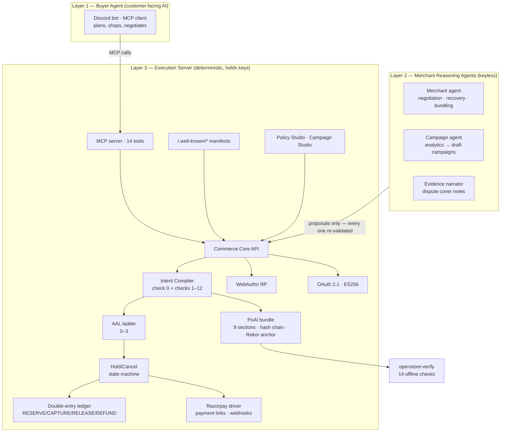
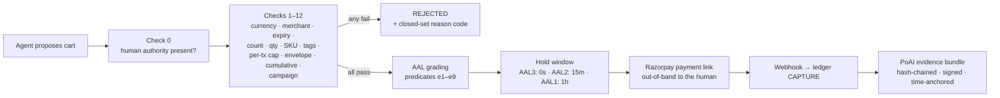

# OpenStore

**Give your store an AI-agent sales channel — with spending rules a human signs, money an AI can never touch, and a receipt no one can dispute.**

```bash
pip install openstore[razorpay]
openstore init --merchant "Gelateria Milano" --currency INR
openstore serve gelateria.yaml
```

Three commands. Your store now speaks to AI agents: a discovery manifest, an agent-readable catalog, MCP commerce tools, checkout, hold/cancel, and a cryptographic evidence trail for every rupee that moves.

> **The pitch in one paragraph.** An AI agent shops your store on behalf of a human. The human's rules — spend caps, allowed items, approved merchants — were signed once with a passkey, and a deterministic compiler enforces them on every cart. The AI never holds payment credentials; it proposes, the compiler disposes. Sixty days later, the customer claims they never authorized the purchase. You export one file, run the verifier **on a laptop with wifi off**, and it proves — hash chain, WebAuthn signature, policy, cart, all byte-identical — exactly what was authorized and by whom. Flip one digit in the file and the verifier names the exact broken link.

---

## Why this exists

2026 is the year of the agentic commerce protocol race: **ACP** (OpenAI/Stripe), **AP2** (Google), **UCP** (Google), **x402** (Coinbase), **Visa TAP**, **Mastercard Agent Pay**, **NPCI UAP**. They all answer the same question: *how does an agent pay?*

None of them answer the harder one: ***what does the merchant hand an arbitrator 90 days later when the human disputes the charge?***

OpenStore is that missing layer — the **adjudication layer** — plus the growth layer on top of it:

| They make a merchant... | OpenStore makes a transaction... |
|---|---|
| transactable (ACP, UCP) | **defensible** (PoAI evidence bundles, offline-verifiable) |
| payable (AP2, TAP, Agent Pay) | **bounded** (human-signed compiler, not vibes) |
| discoverable (manifests, feeds) | **governed** (AAL ladder: stronger proof → faster fulfillment) |

And it's **Razorpay/UPI-native** — the stack the Western protocols don't cover — with an authorization model that maps cleanly onto RBI's e-mandate framework (AFA at registration, frictionless within limits).

---

## The demo

```
ACT 0  pip install openstore[razorpay] && openstore init && openstore serve
       → a store that didn't exist 60 seconds ago is serving
         /.well-known/agent-commerce.json, a catalog feed, and 14 MCP tools

ACT 1  Human signs an IntentPolicy with a passkey:
       "₹2,000/month · ≤₹500 per order · Gelateria only · vegan items only"

ACT 2  Agent: "get me two vegan gelatos" → search → cart → 13 compiler checks pass
       → Razorpay payment link → paid → order HELD (15-min cancel window)

ACT 3  Agent: "add the pistachio" → DENIED: policy.tag_violation
       → buyer agent and merchant agent negotiate over A2A
       → no in-policy path → merchant agent drafts a signed policy amendment
       → human approves with one passkey tap → policy v2 → cart recompiles → ALLOW
       → then: "also, make it ₹600" → DENIED: policy.spend_per_tx_exceeded. No appeal.

ACT 4  Campaign agent reads aggregate sales analytics, drafts "Weekend vegan bundle −10%"
       → merchant approves in Campaign Studio → signed offer hits the feed
       → buyer agents discover it and re-plan around it

ACT 5  Dispute. openstore-verify bundle.json — offline — 14 checks — VERDICT: AAL2.
       Tamper one digit in amount_minor → verifier names the broken hash-chain link.
```

---

## How it works

The system is three layers with one hard rule: **reasoning and money never share a process boundary.**



**The one rule that makes agents safe here (R0.9/R0.10):** LLM output is a *proposal, never a command*. Every agent-produced artifact — a substitution, a price, a campaign, a policy amendment — passes through the same deterministic validators as input from a stranger. The agent modules physically cannot import payment or signing code (enforced by an import-firewall test). A hallucinating or prompt-injected agent can only ever produce a suggestion that gets rejected.

---

## The money path

Nothing reaches Razorpay without surviving all of this, in order:



- **Deterministic compiler** (`core/compiler.py`) — check 0 + 12 checks, fixed order, stop-at-first-failure, byte-stable transcript. No LLM anywhere in the decision path.
- **Idempotency as a contract** — fingerprinted keys, in-flight detection, crash-mid-API-call recovery that adopts the existing Razorpay object instead of double-charging.
- **Double-entry ledger** (`core/ledger.py`) — append-only; escrow accounts net to zero at terminal states; reversals, never edits.
- **Webhooks that expect betrayal** — HMAC verification on raw bytes, dedupe, out-of-order tolerance, dead-letter + alerts, and a sweeper that reconciles against Razorpay as the source of truth.

---

## The receipt: Proof of Authorized Intent (PoAI)

Every completed transaction assembles a **9-section evidence bundle**: what was bought, who authorized it (the WebAuthn-signed policy + assertion), what the agent intended, what the compiler decided (with a re-runnable transcript), what the human was told, and the AAL grading. Sections are SHA-256 hash-chained, the root is ES256-signed by the merchant, and the root is time-anchored to Sigstore's Rekor transparency log (with a local Merkle fallback).

The point: **verification doesn't require trusting the merchant.**

```bash
$ openstore-verify bundle.json --merchant-jwks jwks/
✓ schema            ✓ chain_integrity      ✓ merchant_signature
✓ time_anchor       ✓ webauthn_assertion   ✓ challenge_binding
✓ uv_flag           ✓ catalog_attestations ✓ compiler_digest
✓ re_execution      ✓ amount_consistency   ✓ aal
✓ delegation_chain  ✓ spend_chain

VERDICT: AAL2 — Proposed liability position (not a network rule): the human
authorized a standing policy with a fresh, user-verified signature, and this
cart compiled clean against it...

$ # flip one digit in amount_minor, re-run:
✗ chain_integrity — section "goods", link 3: hash mismatch
(exit 1)
```

The verifier runs fully offline. The Evidence Viewer (`evidence_viewer.html`) re-implements the same checks in a single zero-dependency HTML file using browser WebCrypto — an arbitrator needs nothing but a browser.

---

## The AAL ladder — evidence-graded trust

| Level | What it means | Hold |
|---|---|---|
| **AAL3** | The human's authenticator signed **this exact cart** | 0s — fulfill now |
| **AAL2** | Fresh signed standing policy + clean compile | 15 min cancel window |
| **AAL1** | Authority presented but freshness/attestation predicates failed | 1 hour hold |
| **AAL0** | No verifiable human authority | **No order is created** |

Fulfillment keys off `RELEASED`, never order creation. The cancel link is a single-use 32-byte capability token delivered only to the customer.

---

## Agents

Three agent modules ship in the package, all keyless, all proposal-only:

- **Buyer agent** — Discord bot, MCP client, full planning loop: goal → search → policy-aware cart → checkout → hold monitoring.
- **Merchant agent** — negotiates with buyer agents over structured counter-offers; when no in-policy path exists, drafts a **signed policy amendment** that only activates with a human's passkey tap.
- **Campaign agent** — reads a privacy-bounded aggregate analytics view (never raw orders or PII), drafts campaigns, passes them through a deterministic validator, and publishes **only** after merchant signature.

**Honest status:** the infrastructure for agents to safely transact is solid and heavily tested; the agents themselves are structurally complete but not yet battle-tested against a live LLM in a live conversation. See *What's real / what's next* below.

---

## Security model

- **Credential absence, not credential discipline** — agents can't leak keys they never had (import-firewall tested).
- **WebAuthn** — full FIDO2 relying party: ES256/RS256 only, UV-flag enforcement, sign-count regression detection, challenge-bound ceremonies.
- **OAuth 2.1 + PKCE** — asymmetric ES256 tokens; the validator pins `alg` and verifies the JWS signature against the merchant JWKS before trusting any claim (`alg: none` and algorithm-confusion tokens are rejected — red-team tested).
- **Closed sets everywhere** — every reason code, route, tool name, and enum value lives in `REGISTRY.json`; code containing an unregistered identifier fails the build.
- **Fail loud** — no silent catches, no coercions, no retries of non-retriable errors. Every rejection carries a reason code that ends up in signed evidence.
- **Money is integers, time is UTC** — paise only, no floats; RFC 3339 everywhere (two grandfathered Unix-second exceptions, documented).

**Tested adversarially:** cart-swap, forged tokens, WebAuthn replay, idempotency-key reuse, ledger manipulation, webhook forgery/replay/reorder, OAuth algorithm confusion, prompt injection, spend-cap race conditions (TOCTOU), cross-merchant isolation, PII leakage into traces, agent compiler-bypass attempts. Golden fixtures pin every cryptographic output byte-for-byte.

---

## Quickstart

```bash
pip install openstore[razorpay]
openstore init --merchant "Gelateria Milano" --currency INR
```

Fill in `gelateria-milano.yaml`:

```yaml
merchant:
  name: "Gelateria Milano"
  id: "gelateria-milano"
currency: "INR"
catalog:
  - sku: "GEL-VAN-500"
    name: "Madagascar Vanilla 500ml"
    unit_minor: 21000            # ₹210.00 — integer paise, always
    tags: ["vegan", "dairy-free"]
    related_skus: ["GEL-HAZ-500"]
    description: "Slow-churned, cashew-base vanilla."
```

Add Razorpay **test-mode** keys and an LLM key to `.env`, then:

```bash
openstore serve gelateria-milano.yaml
```

Your store now serves `/.well-known/agent-commerce.json`, `/agent/catalog`, `/agent/mcp`, the signed campaign feed, Policy Studio (`/intent/studio`), Campaign Studio (`/campaign/studio`), and the Evidence Viewer. Open Policy Studio, enrol a passkey, sign your first IntentPolicy — and you're transactable.

Verify a bundle offline:

```bash
openstore-verify orders/<checkout_id>/evidence --merchant-jwks .well-known/poai-jwks.json
```

---

## Project structure

```
src/openstore/
├── core/           # the money path: compiler, ledger, AAL, PoAI, WebAuthn, OAuth, audit, campaigns
├── surfaces/       # MCP server, well-known manifests, studios, catalog feed, storefront
├── agents/         # buyer · merchant · campaign (keyless, proposal-only)
├── psp/            # Razorpay driver + webhook router
├── verify/         # openstore-verify — 14 offline checks, exit codes 0–4
├── models.py       # SQLModel schemas
├── server.py       # FastAPI app factory
├── config.py       # merchant config (closed key set; unknown keys hard-error)
└── cli.py          # openstore init / serve / verify

GOLDEN/             # byte-pinned fixtures: compiler · ledger · PoAI · WebAuthn · canonical · hash-chain · Razorpay
SPECS/              # the ten stage contracts this was built from
tests/              # stage tests · golden tests · red team · sentinels
REGISTRY.json       # every closed set, machine-enforced both directions
```

---

## What's real / what's next

Built by one person with an AI agent over 10 spec'd stages. Here's the honest ledger:

**Real and tested:**
- ✅ The full money path — compiler, ledger, idempotency, hold/cancel, webhooks, reconciliation
- ✅ WebAuthn ceremonies, OAuth with signature-pinned validation, per-merchant signing keys
- ✅ PoAI bundles + offline verifier + tamper detection, with golden fixtures
- ✅ MCP tools, discovery manifests, catalog attestations, campaign pipeline
- ✅ Red-team and sentinel suites green

**Not yet:**
- ❌ **End-to-end live agent demo** — the pipes are laid; the live-LLM conversation isn't connected. The agents run on mocked LLM responses in tests.
- ❌ **Frontend HTML** — Policy Studio/Campaign Studio routes and logic exist; the served single-file pages are next.
- ❌ **Live Razorpay capture** — driver is tested against golden fixtures; live test-mode constant capture is a documented, gated step.
- ❌ **Deployment story** — runs locally on SQLite; Docker/cloud and the sidecar integration contract (health endpoints, origin rules) are specced, not built.
- ❌ **Third-party agent discovery** — the manifest surface exists; indexing by real platforms (ChatGPT/UCP/Merchant Center) is the market gap, not a code gap.

The infrastructure is deliberately overbuilt relative to the agent layer — for a system where getting the money wrong is worse than getting the UX wrong, that's the right trade.

---

## Built with

Python 3.12 · FastAPI · SQLModel · SQLite (`BEGIN IMMEDIATE`) · Razorpay test mode · WebAuthn (`py_webauthn`) · ES256 JWS · Sigstore Rekor · discord.py · uv

Built by [Joseph Fernando](https://github.com/) with [OpenCode](https://github.com/sst/opencode), across 10 stages in ~9 days, from a PRD that treats identifiers as law. The PRD and stage specs are in this repo — `OPENSTORE_PRD_v3.md` and `SPECS/` are arguably the real product.

## License

MIT (see `LICENSE`).
