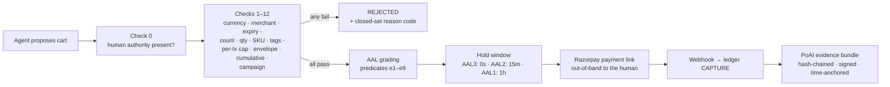

# OpenStore

**Give your store an AI-agent sales channel — with spending rules a human signs, money an AI can never touch, and a receipt no one can dispute.**

> Built for the **Razorpay Buildathon**, Track 01 — *AI Growth & Agentic Commerce*.
> Joseph Fernando · CIT Chennai · one person, one AI pair-programmer, twelve stages.

```bash
uv sync
uv run openstore init --merchant "Gelateria Milano" --currency INR
uv run openstore serve gelateria.yaml
```

Three commands. Your store now speaks to AI agents: a discovery manifest, an agent-readable catalog, 18 MCP commerce tools, checkout, hold/cancel, and a cryptographic evidence trail for every rupee that moves.

> **The pitch in one paragraph.** An AI agent shops your store on behalf of a human. The human's rules — spend caps, allowed items, approved merchants — were signed once with a passkey, and a deterministic compiler enforces them on every cart. The AI never holds payment credentials; it proposes, the compiler disposes. Sixty days later, the customer claims they never authorized the purchase. You export one file, run the verifier **on a laptop with wifi off**, and it proves — hash chain, WebAuthn signature, policy, cart, all byte-identical — exactly what was authorized and by whom. Flip one digit in the file and the verifier names the exact broken link.

**Jump to:** [Why this exists](#why-this-exists) · [The demo](#the-demo) · [How it works](#how-it-works) · [The money path](#the-money-path) · [PoAI](#the-receipt-proof-of-authorized-intent-poai) · [Agents](#the-agent-layer) · [Getting started](#getting-started) · [What's real / what's next](#whats-real--whats-next)

---

## Why this exists

2026 is the year of the agentic commerce protocol race: **ACP** (OpenAI/Stripe/Meta), **UCP** (Google/Shopify), **AP2** (Google), **x402** (Coinbase), **Visa TAP**, **Mastercard Agent Pay**, **NPCI UAP**. They all answer the same question: *how does an agent pay?*

None of them answer the harder one: ***what does the merchant hand an arbitrator 90 days later when the human disputes the charge?***

OpenStore is that missing layer — the **adjudication layer** — plus the growth layer on top of it:

| They make a merchant... | OpenStore makes a transaction... |
|---|---|
| transactable (ACP, UCP) | **defensible** (PoAI evidence bundles, offline-verifiable) |
| payable (AP2, TAP, Agent Pay) | **bounded** (human-signed compiler, not vibes) |
| discoverable (manifests, feeds) | **governed** (AAL ladder: stronger proof → faster fulfillment) |

Where it overlaps, it interoperates rather than competes. The sidecar serves
MCP at `/agent/mcp` and a **UCP** capability manifest at `/.well-known/ucp`
(`dev.ucp.shopping.checkout`, `dev.ucp.shopping.discount`) — declaring only what
it actually implements. And the authorization model landed on the same shape
**AP2** later specified: a signed `IntentPolicy` is structurally an Intent
Mandate, a per-cart assertion a Cart Mandate. The difference is what enforces
them — a deterministic compiler whose transcript is replayable, rather than a
credential a merchant is trusted to honour.

**x402 is deliberately not on the roadmap.** It solves stablecoin micropayments
between machines; this is an INR/UPI stack for human-authorized purchases. There
is no honest integration story, so there isn't one.

And it's **Razorpay/UPI-native** — the stack the Western protocols don't cover — with an authorization model that maps cleanly onto RBI's e-mandate framework (AFA at registration, frictionless within limits).

### Why a sidecar, and not a platform

A merchant already has a store. Asking them to migrate it to be agent-ready is
a non-starter, so OpenStore bolts on beside the existing one and is designed
around a single seam: **every piece of catalog and order data flows through one
access point.** Today that reads a YAML file, because that is what could be
built and proven correct in the time available. Nothing above that line — the
compiler, checkout, the agent layer — knows or cares. Point the same function
at a Postgres query or a Shopify Admin API call and the merchant's real
inventory shows up unchanged everywhere else in the system.

---

## The demo

The full recording script, beat by beat, is in [`docs/DEMO_SCRIPT.md`](docs/DEMO_SCRIPT.md).

```
ACT 0  uv run openstore init && uv run openstore serve
       → a store that didn't exist 60 seconds ago is serving
         /.well-known/agent-commerce.json, /.well-known/ucp, a catalog feed, and 18 MCP tools

ACT 1  Human signs an IntentPolicy with a passkey:
       "₹2,000/month · ≤₹500 per order · Gelateria only · vegan items only"

ACT 2  Agent: "get me two vegan gelatos" → search → cart → 13 compiler checks pass
       → Razorpay payment link → paid → order HELD (15-min cancel window)

ACT 3  Agent: "add the pistachio" → DENIED: policy.tag_violation
       → buyer agent and merchant agent negotiate in the same DM thread
       → no in-policy path → merchant agent drafts a signed policy amendment
       → human approves with one passkey tap → policy v2 → cart recompiles → ALLOW
       → then: "also, make it ₹600" → DENIED: policy.spend_per_tx_exceeded. No appeal.

ACT 4  Campaign agent notices a stalled SKU, reads aggregate sales analytics, drafts
       "Weekend vegan bundle −10%" → merchant approves in Campaign Studio with a passkey
       → signed offer hits the feed → buyer agents discover it and re-plan around it

ACT 5  Dispute. openstore-verify bundle.json — offline — 14 checks — VERDICT: AAL2.
       Tamper one digit in amount_minor → verifier names the broken hash-chain link.
```

---

## How it works

The system is three layers with one hard rule: **reasoning and money never share a process boundary.**


**The one rule that makes agents safe here (R0.9/R0.10):** LLM output is a *proposal, never a command*. Every agent-produced artifact — a substitution, a price, a campaign, a policy amendment — passes through the same deterministic validators as input from a stranger. The agent modules physically cannot import payment or signing code (enforced by an import-firewall test). A hallucinating or prompt-injected agent can only ever produce a suggestion that gets rejected.

---

## The money path

Nothing reaches Razorpay without surviving all of this, in order:



- **Deterministic compiler** (`core/compiler.py`) — check 0 + 12 checks, fixed order, stop-at-first-failure, byte-stable transcript. No LLM anywhere in the decision path.
- **Idempotency as a contract** (`core/idempotency.py`) — fingerprinted keys, in-flight detection, crash-mid-API-call recovery that adopts the existing Razorpay object instead of double-charging.
- **Double-entry ledger** (`core/ledger.py`) — append-only; escrow accounts net to zero at terminal states; reversals, never edits.
- **Webhooks that expect betrayal** (`core/webhooks.py`) — HMAC verification on raw bytes, dedupe, out-of-order tolerance, dead-letter + alerts, and a sweeper that reconciles against Razorpay as the source of truth.

---

## The receipt: Proof of Authorized Intent (PoAI)

Every completed transaction assembles a **9-section evidence bundle**: what was bought, who authorized it (the WebAuthn-signed policy + assertion), what the agent intended, what the compiler decided (with a re-runnable transcript), what the human was told, and the AAL grading. Sections are SHA-256 hash-chained, the root is ES256-signed by the merchant, and the root is time-anchored to Sigstore's Rekor transparency log (with a local Merkle fallback).

The point: **verification doesn't require trusting the merchant.**

```bash
$ uv run openstore-verify bundle.json --merchant-jwks jwks/
✓ schema            ✓ chain_integrity      ✓ merchant_signature
✓ time_anchor       ✓ webauthn_assertion   ✓ challenge_binding
✓ uv_flag           ✓ catalog_attestations ✓ compiler_digest
✓ re_execution      ✓ amount_consistency   ✓ aal
✓ delegation_chain  ✓ spend_chain

VERDICT: AAL2 — Proposed liability position (not a network rule): the human
authorized a standing policy with a fresh, user-verified signature, and this
cart compiled clean against it...

$ # flip one digit in amount_minor, re-run:
✗ chain_integrity — section "goods", link 3: hash mismatch
(exit 1)
```

The verifier runs fully offline, and both demo bundles — one clean, one with a
single tampered digit — are checked into [`docs/demo_assets/`](docs/demo_assets)
so the two verdicts reproduce without running the stack. The Evidence Viewer
(`/orders/{checkout_id}/evidence/view`) re-implements the same 14 checks in a
single zero-dependency HTML page using browser WebCrypto — an arbitrator needs
nothing but a browser.

---

## The AAL ladder — evidence-graded trust

| Level | What it means | Hold |
|---|---|---|
| **AAL3** | The human's authenticator signed **this exact cart** | 0s — fulfill now |
| **AAL2** | Fresh signed standing policy + clean compile | 15 min cancel window |
| **AAL1** | Authority presented but freshness/attestation predicates failed | 1 hour hold |
| **AAL0** | No verifiable human authority | **No order is created** |

Fulfillment keys off `RELEASED`, never order creation. The cancel link is a single-use 32-byte capability token delivered only to the customer.

---

## The agent layer

Five agent surfaces ship in the package. All of them are keyless, all of them are proposal-only, and none of them can move money:

- **Buyer agent** (`agents/buyer_graph.py`) — a LangGraph loop behind a Discord DM: goal → search → policy-aware cart → checkout → hold monitoring, with free-text handling for menu, cart, order status and cancellation. It searches **every merchant it is enrolled with** over HTTP MCP and builds one cart tagged per line with `merchant_id`.
- **Merchant agent** (`agents/merchant_agent.py`) — negotiates with buyer agents over structured counter-offers; when no in-policy path exists, drafts a **signed policy amendment** that only activates with a human's passkey tap.
- **Campaign agent** (`agents/campaign_agent.py`) — reads a privacy-bounded aggregate analytics view (never raw orders or PII), drafts campaigns, passes them through a deterministic validator, and publishes **only** after a merchant passkey approval bound to that specific campaign. The discount itself is applied by compiler check 12, never taken on the offer's word.
- **Growth-trigger loop** (DECISION-034) — the autonomous half. A background task inside each `openstore serve` process watches for stalled SKUs (units sold over 30 days below the configured floor), drafts a campaign unprompted, and after the campaign runs compares before/after units sold so the next draft is informed by the last one's outcome. On demand: `uv run openstore campaign check-growth configs/chai.yaml`.
- **Merchant bot** (`agents/merchant_bot.py`) — a read-only reporting bot the merchant DMs for campaign status, exposure against policy caps, and recent orders. Its action set contains no mutating action **by construction, not by prompt instruction.**

---

## Security model

- **Credential absence, not credential discipline** — agents can't leak keys they never had (import-firewall tested).
- **WebAuthn** — full FIDO2 relying party: ES256/RS256 only, UV-flag enforcement, sign-count regression detection, challenge-bound ceremonies.
- **OAuth 2.1 + PKCE** — asymmetric ES256 tokens; the validator pins `alg` and verifies the JWS signature against the merchant JWKS before trusting any claim (`alg: none` and algorithm-confusion tokens are rejected — red-team tested).
- **Closed sets everywhere** — every reason code, route, tool name, and enum value lives in `REGISTRY.json`; code containing an unregistered identifier fails the build (`scripts/registry_diff.py`).
- **Fail loud** — no silent catches, no coercions, no retries of non-retriable errors. Every rejection carries a reason code that ends up in signed evidence.
- **Money is integers, time is UTC** — paise only, no floats; RFC 3339 everywhere (two grandfathered Unix-second exceptions, documented).

**Tested adversarially:** cart-swap, forged tokens, WebAuthn replay, idempotency-key reuse, ledger manipulation, webhook forgery/replay/reorder, OAuth algorithm confusion, prompt injection, spend-cap race conditions (TOCTOU), cross-merchant isolation, PII leakage into traces, agent compiler-bypass attempts. Golden fixtures pin every cryptographic output byte-for-byte.

---

## Getting started

### A fresh sidecar for your own store

```bash
uv sync
uv run openstore init --merchant "Gelateria Milano" --currency INR
```

That writes `gelateria.yaml`, `catalog.yaml` and `.env.example`. Fill in the catalog:

```yaml
catalog:
  - sku: "GEL-VAN-500"
    name: "Madagascar Vanilla 500ml"
    unit_minor: 21000            # ₹210.00 — integer paise, always
    tags: ["vegan", "dairy-free"]
    related_skus: ["GEL-HAZ-500"]
    description: "Slow-churned, cashew-base vanilla."
```

Add Razorpay **test-mode** keys (and an LLM key, if you want the agent layer) to `.env`, then:

```bash
uv run openstore serve gelateria.yaml
```

Your store now serves `/.well-known/agent-commerce.json`, `/.well-known/ucp`, `/agent/catalog`, `/agent/mcp`, the signed campaign feed, Policy Studio (`/intent/studio`), Campaign Studio (`/campaign/studio`) and the Evidence Viewer. Open Policy Studio, enrol a passkey, sign your first `IntentPolicy` — and you're transactable.

Verify a completed order's evidence, offline:

```bash
curl http://localhost:8000/orders/<checkout_id>/evidence -o bundle.json
uv run openstore-verify bundle.json --merchant-jwks <(curl -s http://localhost:8000/.well-known/poai-jwks.json)
```

> Packaged as `openstore` with three entry points (`openstore`,
> `openstore-verify`, `openstore-buyer`), but **not published to PyPI** — run it
> from this repo with `uv`.

### This repo's own demo instance

Two merchants (Gelateria Milano on `:8000`, Chai House on `:8001`), a federated
buyer process, and a merchant reporting bot. The full boot sequence — secrets,
migrations, OAuth client registration, analytics seeding — is in
[`docs/RUN.md`](docs/RUN.md).

```bash
uv run openstore serve configs/gelateria.yaml --port 8000
uv run openstore serve configs/chai.yaml --port 8001
uv run openstore-buyer configs/buyer.yaml
uv run openstore merchant-bot configs/gelateria.yaml configs/chai.yaml
```

### Running the checks

```bash
uv run pytest -q                        # 626 tests
uv run mypy src/
uv run ruff check src/ tests/
uv run python scripts/registry_diff.py  # must print nothing, exit 0
```

No live credentials needed — the suite mocks Razorpay, Discord and the LLM providers, and runs on temp SQLite.

---

## Project structure

```
src/openstore/
├── core/           # the money path: compiler, ledger, AAL, PoAI, WebAuthn, OAuth, audit, campaigns
├── surfaces/       # MCP server, well-known manifests, studios, catalog feed, evidence viewer
├── agents/         # buyer · merchant · campaign · merchant bot (keyless, proposal-only)
├── psp/            # Razorpay driver + webhook router
├── verify/         # openstore-verify — 14 offline checks, exit codes 0–4
├── models.py       # SQLModel schemas
├── server.py       # FastAPI app factory + background tasks (hold expiry, growth loop)
├── config.py       # merchant config (closed key set; unknown keys hard-error)
├── cli.py          # openstore init / serve / campaign / merchant-bot
└── buyer_cli.py    # openstore-buyer — the federated buyer process

configs/            # this repo's demo instance: two merchants + the buyer
data/               # SQLite DBs — gitignored, created by migrations on first boot
tests/              # stage tests · golden tests · red team · sentinels
tests/GOLDEN/       # byte-pinned fixtures: compiler · ledger · PoAI · WebAuthn · canonical · Razorpay
docs/SPECS/         # the eleven stage contracts this was built from
REGISTRY.json       # every closed set, machine-enforced both directions
```

### The documents behind it

| File | What it is |
|---|---|
| [`docs/OPENSTORE_PRD_v3.md`](docs/OPENSTORE_PRD_v3.md) | the requirements doc everything was built from |
| [`docs/SPECS/`](docs/SPECS) | eleven stage contracts — each one a testable slice (Stage 12 shipped against DECISION-022 instead) |
| [`docs/DECISIONS.md`](docs/DECISIONS.md) | numbered architectural decisions, and why the alternatives lost |
| [`docs/OPEN_QUESTIONS.md`](docs/OPEN_QUESTIONS.md) | what's still unresolved, honestly |
| [`docs/RUN.md`](docs/RUN.md) | how to boot the two-merchant demo |
| [`docs/DEMO_SCRIPT.md`](docs/DEMO_SCRIPT.md) | the 6-minute walkthrough, beat by beat |

---

## What's real / what's next

Built by one person with an AI agent over twelve stages. Here's the honest ledger:

**Real and tested:**
- ✅ The full money path — compiler, ledger, idempotency, hold/cancel, webhooks, reconciliation
- ✅ WebAuthn ceremonies, OAuth with signature-pinned validation, per-merchant signing keys
- ✅ PoAI bundles + offline verifier + tamper detection, with golden fixtures
- ✅ 18 MCP tools, discovery manifests, catalog attestations, campaign pipeline
- ✅ Red-team and sentinel suites green — **626 tests**, `mypy` and `ruff` clean
- ✅ **Chat-native purchase flow (Stage 11)** — a live `discord.Client` runs in the server's
  lifespan; a buyer DMs the bot, gets a `handoffs`-table signing link if no policy exists,
  auto-resumes the errand on signature, gets the Razorpay pay link and hold/cancel status
  in-DM, and can cancel with a single-use capability token. A denied cart triggers
  `MerchantAgent.negotiate()` in the same thread; when no in-policy path exists the merchant
  drafts a one-time policy amendment the human approves with a second passkey tap
  (`{"mode":"amendment",...}` WebAuthn binding), which recompiles the cart against an
  unpersisted, relieved `IntentPolicy` snapshot — never mutating the standing signed policy.
  `/orders/{checkout_id}/evidence` assembles the PoAI bundle with the chat request text as
  `human_intent` and the DM receipt as `notification`.
- ✅ **Federated multi-merchant shopping (Stage 12)** — one buyer process searches N merchant
  origins over HTTP MCP, builds one cart tagged per line with `merchant_id`, and creates
  separate per-merchant checkouts in two phases. Each merchant holds its own signed policy;
  there is no signing hub, so there is no shared budget to double-spend (DECISION-022). A
  buyer-hosted page aggregates the per-merchant signing links.
- ✅ **Campaigns reach buyers, and draft themselves** — the growth loop detects a stalled SKU,
  the campaign agent drafts from an aggregate analytics view, the merchant approves with a
  passkey bound to that specific campaign, and the buyer agent discovers the live offer and
  applies it — with the discount recomputed server-side by compiler check 12 and recorded in
  the evidence bundle. Post-campaign deltas feed the next draft (DECISION-034).

**Not yet:**
- ❌ **Payment stays outside the conversation** — the buyer gets a Razorpay hosted-page link
  and completion arrives by webhook. A late or lost webhook leaves them with no signal until
  the hold expires. This is the one place the UX is clearly behind ACP, whose Shared Payment
  Token exists so the buyer never leaves the agent surface. Scoped in Q-032; both candidate
  repairs touch the money path and deserve their own stage.
- ❌ **AAL2/AAL3 from chat** — there is no chat ceremony that produces a fresh per-cart
  passkey assertion, so a chat-only checkout grades at AAL1 rather than AAL2. The Policy
  Studio says so on the form. Scoped in Q-033; the WebAuthn binding mode already exists, but
  a new `HandoffKind` is a closed-set change.
- ❌ **Frontend polish** — Policy Studio, Campaign Studio and the Evidence Viewer are served
  and functional, but they're utilitarian, not designed.
- ❌ **Live Razorpay capture at scale** — the driver is tested against golden fixtures and
  exercised against real test-mode payment links; sustained live-mode traffic is untested.
- ❌ **Deployment story** — runs locally on SQLite; Docker/cloud beyond the sidecar
  integration contract (SID-1..7, implemented at the Stage 10 freeze).
- ❌ **Third-party agent discovery** — the manifest surface exists; being indexed by real
  platforms (ChatGPT/UCP/Merchant Center) needs MCP wire-protocol conformance and dynamic
  client registration on top of hosting. That's the next stage, not a missing idea.

The infrastructure is deliberately overbuilt relative to the agent layer — for a system where getting the money wrong is worse than getting the UX wrong, that's the right trade.

---

## Built with

Python 3.12 · FastAPI · SQLModel · SQLite (`BEGIN IMMEDIATE`) · Alembic · Razorpay test mode · WebAuthn (`py_webauthn`) · ES256 JWS · Sigstore Rekor · LangGraph · discord.py · uv

Built by [Joseph Fernando](https://github.com/) with [OpenCode](https://github.com/sst/opencode), across twelve stages, from a PRD that treats identifiers as law. The PRD and stage specs are in this repo — `docs/OPENSTORE_PRD_v3.md` and `docs/SPECS/` are arguably the real product.

## License

MIT. (No `LICENSE` file checked in yet — that's on the list.)
