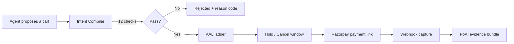

# OpenStore

An installable Python sidecar that makes a merchant transactable by AI agents.

```
pip install openstore[razorpay]
```

The idea: a merchant drops OpenStore into their stack, points it at a product catalog YAML, and their store becomes something an AI agent can browse, negotiate with, and buy from — with real money, real authorization, and a cryptographic receipt at the end.

This is a solo project by Joseph Fernando, built almost entirely by Claude (Anthropic's AI) across 10 development stages over about 9 days. I'll be honest about what exists and what doesn't below.

## What's actually here

~9,200 lines of Python across 35 modules, plus ~6,600 lines of tests. The project was built stage-by-stage following a detailed PRD, and most of what got built is **infrastructure** — the financial plumbing, security machinery, and verification tooling that would need to exist before any agent can safely spend money.

### The money path

The core of the project is a deterministic pipeline that sits between "an agent wants to buy something" and "money actually moves." Nothing touches Razorpay without going through every step.



**Intent Compiler** (`core/compiler.py`) — 12 deterministic checks run in a fixed order: policy expiry, currency match, merchant match, SKU validation, tag restrictions, per-transaction spend caps, cumulative spend caps, campaign eligibility, and more. Every check produces a pass/fail entry in the transcript. There's no "close enough" — a cart either passes all 12 or gets rejected with a specific reason code.

**Double-entry ledger** (`core/ledger.py`) — Every money movement (reserve, capture, release, refund) gets two entries that must balance. Idempotency keys prevent duplicate charges.

**AAL ladder** (`core/aal.py`, `core/holdcancel.py`) — Four authorization levels (AAL0–AAL3) that control how much human oversight a transaction needs:
- AAL3: WebAuthn-verified, immediate
- AAL2: WebAuthn-verified, 15-minute hold window for cancellation
- AAL1: Lower-assurance, 1-hour hold
- AAL0: No human in the loop (autonomous agent spending within a capped policy)

**Proof of Autonomous Intent** (`core/poai.py`) — After a successful transaction, a 9-section evidence bundle gets assembled with a SHA-256 hash chain. The bundle captures what was bought, who authorized it, what the compiler decided, and the AAL level. It's designed to be independently verifiable — there's an offline verifier (`verify/`) that can check a bundle without talking to the server.

### Security and authorization

**WebAuthn** (`core/webauthn_rp.py`) — Full relying-party implementation for FIDO2 hardware keys. Registration, assertion verification, sign-count regression detection. ES256 and RS256 supported; EdDSA explicitly rejected with a clear error.

**OAuth 2.1** (`core/oauth.py`) — Asymmetric ES256 JWT access tokens. The token validator pins the `alg` header and verifies the JWS signature against the merchant's public key before trusting any claim.

**Policy signing** (`core/policy_signing.py`) — IntentPolicies go through a signing ceremony that validates the policy version, checks per-user aggregate spending caps, and anchors the policy to a human operator.

**Audit logging** (`core/audit.py`) — Every action that matters gets an audit entry with trace ID, client ID, resource type, request metadata, and structured detail.

### Surfaces

**MCP server** (`surfaces/mcp_server.py`) — 14 tools (search products, create cart, initiate checkout, etc.) that an MCP-compatible agent can call. Thin adapters over the core API with scope enforcement.

**Well-known endpoints** (`surfaces/wellknown.py`) — Standard discovery endpoints (`/.well-known/agent-commerce.json`, `/.well-known/agent-policy.json`, etc.) so agents can find and understand the store.

**Policy Studio** (`surfaces/studio.py`) — A web UI for merchants to create and sign IntentPolicies. Handles the WebAuthn registration and assertion ceremony.

**Catalog feed** (`surfaces/catalog.py`) — Loads product catalogs from YAML files. Each item has a SKU, name, integer price in minor units (paise), tags, and stock count.

### Agents (the honest part)

There are three agent modules: `BuyerAgent`, `MerchantAgent`, and `CampaignAgent`. They exist, they have the right structure, and they route through the compiler like they should. But they're more scaffolding than intelligence right now.

The buyer agent has a planning loop (parse goal → search → build cart → checkout) but falls back to stubs without an MCP client. The merchant agent handles negotiation state machines and can draft counter-proposals through an LLM, but it hasn't been tested against a real model in a real conversation. The campaign agent reads analytics views and drafts promotional campaigns — again, structurally sound but not battle-tested.

So: the infrastructure for agents to safely transact is solid. The agents themselves are the next real piece of work.

### Testing

The test suite is thorough for what it covers:

- **Golden tests** — The `GOLDEN/` directory has fixture files for the compiler, ledger, PoAI bundles, WebAuthn assertions, and Razorpay webhook payloads. Tests run against these and break if the output changes.
- **Red team tests** — `tests/redteam/` has adversarial tests for cart-swap attacks, WebAuthn replay, idempotency key reuse, ledger manipulation, webhook forgery, OAuth algorithm confusion, prompt injection, and more.
- **Sentinel tests** — Schema snapshot tests, enum exhaustiveness checks, route table verification, import firewall (agents can't import PSP modules).
- **Stage tests** — Each development stage has its own test module covering what was built in that stage.

## Architecture

```mermaid
flowchart TB
    subgraph Surfaces
        MCP[MCP Server<br/>14 tools]
        WK[Well-Known<br/>discovery]
        Studio[Policy Studio<br/>WebAuthn UI]
        REST[FastAPI routes]
    end

    subgraph Core
        API[Commerce API<br/>single entry point]
        Compiler[Intent Compiler<br/>12 checks]
        Ledger[Double-Entry Ledger]
        AAL[AAL Ladder]
        HC[Hold/Cancel<br/>state machine]
        POAI[PoAI Bundle<br/>evidence chain]
        WA[WebAuthn RP]
        OAuth[OAuth 2.1<br/>ES256 JWTs]
        Audit[Audit Log]
        Campaigns[Campaign engine]
    end

    subgraph PSP
        RZ[Razorpay driver]
        WH[Webhook handler]
    end

    subgraph Agents
        Buyer[Buyer Agent]
        Merchant[Merchant Agent]
        Campaign[Campaign Agent]
    end

    subgraph Verify
        CLI[openstore-verify CLI]
        Checks[14 offline checks]
    end

    MCP & WK & Studio & REST --> API
    API --> Compiler --> AAL --> HC
    HC --> Ledger
    HC --> RZ
    RZ --> WH --> Ledger
    Compiler --> POAI
    API --> WA
    API --> OAuth
    API --> Audit
    API --> Campaigns
    Buyer & Merchant & Campaign -->|proposals only| MCP
    CLI --> Checks
```



## Project structure

```
src/openstore/
├── core/           # The money path: compiler, ledger, AAL, PoAI, WebAuthn, OAuth, audit
├── surfaces/       # How the outside world talks to core: MCP, well-known, studio, catalog
├── agents/         # Buyer, merchant, campaign agents (scaffolding, see above)
├── psp/            # Payment service provider: Razorpay driver and webhook router
├── verify/         # Offline PoAI bundle verifier (14 checks, CLI)
├── models.py       # SQLModel schemas for all tables
├── server.py       # FastAPI app factory
├── config.py       # Settings and merchant config
└── cli.py          # CLI entry point

GOLDEN/             # Deterministic test fixtures (compiler, ledger, PoAI, WebAuthn, Razorpay)
SPECS/              # Stage-by-stage build specs (01–10)
tests/              # Stage tests, golden tests, red team, sentinel
```

## Config

OpenStore reads a merchant YAML config. Here's what a catalog looks like:

```yaml
items:
  - sku: "chai_masala"
    name: "Masala Chai"
    unit_minor: 8000          # ₹80.00 in paise
    tags: ["chai", "spiced"]
    stock: 200
```

All money is in integer minor units (paise). No floats anywhere.

## What's missing

Being straight about it:

- **No end-to-end agent demo.** You can't point an LLM at this today and watch it buy chai. The pipes are laid but the faucet isn't connected.
- **No frontend.** Policy Studio has routes but no served HTML.
- **No deployment story.** It runs locally with SQLite. No Docker, no cloud config.
- **No real MCP integration test.** The MCP tools exist and are tested in isolation, but nobody's plugged a real MCP client into them.
- **Razorpay is test-mode only.** The driver handles payment links and webhooks, but it's been tested against golden fixtures, not the live sandbox.

## The approach

This was built by Claude in 10 stages over ~9 days, following a very prescriptive PRD (Part 0 of the PRD is literally "rules for the implementer"). Each stage had a spec, got built, got tested, got reviewed, got fixed, and moved on. The PRD enforced some strong constraints — closed-set enums, no invented identifiers, fail-loud everywhere, every money value in integer paise, every timestamp in UTC.

The result is a codebase where the money path is careful and the verification is real, but the "agent" part — the thing that makes this interesting to a user — is more promise than delivery. The infrastructure is overbuilt relative to the agent layer, which is about right for a system where getting the money wrong is worse than getting the UX wrong.

## License

Not yet specified.
